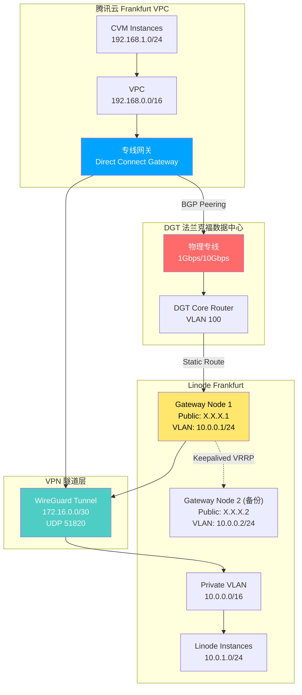

# Private Network Interconnect (PNI) 方案文档

**Linode 与腾讯云法兰克福数据中心专线互联技术方案**

---

## 目录

- [一、方案概述](#一方案概述)
- [二、现状分析](#二现状分析)
- [三、架构设计](#三架构设计)
- [四、技术实施路径](#四技术实施路径)
- [五、详细配置步骤](#五详细配置步骤)
- [六、网络验证与测试](#六网络验证与测试)
- [七、成本分析](#七成本分析)
- [八、高可用设计](#八高可用设计)
- [九、故障排查指南](#九故障排查指南)
- [十、参考资料](#十参考资料)

---

## 一、方案概述

本方案旨在实现 **Linode (Akamai)** 与 **腾讯云** 在德国法兰克福数据中心的**二层私网打通**，通过 DRT 物理专线建立安全、稳定、低延迟的专线通道，**确保所有流量不走公网**。

### 核心目标
- ✅ **二层私网打通**，实现真正的内网互联
- ✅ **流量完全不走公网**，提供企业级安全保障
- ✅ 低延迟（< 3ms）、高带宽（1-10Gbps）
- ✅ 数据安全加密传输（WireGuard 隧道层）
- ✅ 支持动态路由协议（BGP）
- ✅ 高可用架构设计

### 数据中心信息
- **Linode 机房**: FRA10（DGT 法兰克福数据中心）
- **腾讯云机房**: FRA14（DGT 法兰克福数据中心）
- **物理专线供应商**: DRT (Deutsche Rechenzentren Technik)
- **专线类型**: 同数据中心园区内交叉连接（Campus Cross Connect）

### 技术挑战
- ⚠️ Linode 无原生跨云专线产品
- ⚠️ VLAN 仅支持单数据中心内使用
- ⚠️ 需要自建 Gateway 节点和 VPN 隧道
- ⚠️ 需要协调 DRT 数据中心进行物理布线

---

## 二、现状分析

### 2.1 Linode (Akamai) 网络能力

| 功能 | 支持情况 | 限制 |
|------|---------|------|
| **VLAN** | ✅ 支持 | 仅单数据中心内使用 |
| **跨数据中心互联** | ⚠️ WireGuard VPN | 需自建隧道 |
| **物理专线** | ❌ 无托管服务 | 无类似 AWS Direct Connect 的产品 |
| **BGP 路由** | ⚠️ 需自配置 | 通过 FRRouting 等开源软件 |
| **私网 IP** | ✅ 支持 | VLAN 内分配私网地址 |

**参考文档:**
- [Private Networking | Akamai - Linode](https://www.linode.com/products/private-networking/)
- [Getting Started with VLANs | Linode Docs](https://www.linode.com/docs/products/networking/vlans/get-started/)
- [Implementing Redundant Cross-Data Center Applications](https://www.linode.com/docs/reference-architecture/redundant-cross-datacenter-applications/guides/implementing-redundant-cross-datacenter-applications/)

### 2.2 腾讯云网络能力

| 功能 | 支持情况 | 能力 |
|------|---------|------|
| **专线接入 (DC)** | ✅ 完整支持 | 物理专线、专用通道 |
| **云联网 (CCN)** | ✅ 全球互联 | 30+ 地域，100Gbps 带宽 |
| **法兰克福接入点** | ✅ 支持 | DGT 数据中心 |
| **BGP 路由** | ✅ 原生支持 | ASN 45090 |
| **专线网关** | ✅ 支持 | VPC/CCN 专线网关 |

**参考文档:**
- [云联网CCN - 腾讯云](https://cloud.tencent.com/product/ccn)
- [专线接入点 - 腾讯云](https://cloud.tencent.com/document/product/216/58779)

---

## 三、架构设计

### 3.1 整体架构图



### 3.2 网络拓扑层次

```
┌────────────────────────────────────────────────────────────────┐
│ 应用层                                                          │
│  - 微服务跨云通信                                               │
│  - 数据库主从复制                                               │
│  - 对象存储同步                                                 │
└────────────────────────────────────────────────────────────────┘
                              ↓
┌────────────────────────────────────────────────────────────────┐
│ 传输层 (Encrypted)                                              │
│  WireGuard VPN Tunnel (ChaCha20-Poly1305)                      │
│  - 点对点加密                                                   │
│  - 密钥轮换                                                     │
└────────────────────────────────────────────────────────────────┘
                              ↓
┌────────────────────────────────────────────────────────────────┐
│ 网络层                                                          │
│  - BGP 路由交换 (腾讯云侧)                                      │
│  - 静态路由 (Linode 侧)                                         │
│  - VLAN 隔离                                                    │
└────────────────────────────────────────────────────────────────┘
                              ↓
┌────────────────────────────────────────────────────────────────┐
│ 物理层                                                          │
│  - 单模光纤 (SMF) 10km                                          │
│  - LC/SC 连接器                                                 │
│  - 1000BASE-LX/10GBASE-LR                                       │
└────────────────────────────────────────────────────────────────┘
```

### 3.3 路由流向图

```
腾讯云 CVM (192.168.1.10)
    ↓ [查询路由表]
目标: 10.0.1.0/24 → 下一跳: 专线网关
    ↓
专线网关 (BGP 发布路由)
    ↓ [VLAN 100]
DGT 路由器 (172.31.255.1)
    ↓ [静态路由]
Linode Gateway Node (172.31.255.2)
    ↓ [WireGuard 解密]
VLAN Interface (10.0.0.1)
    ↓ [二层转发]
Linode VM (10.0.1.20)
```

---

## 四、技术实施路径

### 方案 A: WireGuard VPN over 专线（推荐）

#### 优势
- ✅ 成本可控（~$350-550/月）
- ✅ 技术成熟稳定
- ✅ 配置灵活可控
- ✅ 支持自动化部署

#### 劣势
- ⚠️ 需要维护 Gateway 节点
- ⚠️ 受限于 Linode 网络限制
- ⚠️ 需要自行管理密钥和路由

#### 适用场景
- 中小规模跨云互联（< 50 台机器）
- 对延迟不敏感（可接受 5-10ms）
- 需要灵活的网络配置

---

### 方案 B: 第三方互联平台（不推荐）

#### 通过 Megaport/Equinix Fabric

```
腾讯云专线接入
    ↓
Megaport VXC (Virtual Cross Connect)
    ↓
Linode (如有支持)
```

#### 劣势
- ❌ Linode 未公开支持 Megaport 集成
- ❌ 成本高（额外 $200-500/月）
- ❌ 需要额外的运维复杂度

#### 参考资料
- [Megaport 云互联平台](https://www.megaport.com/)
- [Equinix Fabric](https://www.equinix.com/interconnection-services/equinix-fabric)

---

## 五、详细配置步骤

### 5.1 腾讯云侧配置

#### Step 1: 申请物理专线

```bash
# 控制台路径
私有网络 → 专线接入 → 物理专线 → 申请专线

# 配置参数
接入点: 欧洲-法兰克福-DGT-A
端口类型: 1Gbps 电口 / 10Gbps 光口
运营商: 自建 (Self-Built)
```

#### Step 2: 创建专线网关

```bash
# CLI 命令
tccli vpc CreateDirectConnectGateway \
  --DirectConnectGatewayName "Frankfurt-DCG" \
  --NetworkType VPC \
  --GatewayType NORMAL

# 返回参数
DirectConnectGatewayId: dcg-xxxxxxxx
```

#### Step 3: 创建专用通道

```bash
# 配置参数
通道名称: TC-to-Linode-Channel
VLAN ID: 100
互联 IP:
  - 腾讯云侧: 172.31.255.1/30
  - 用户侧: 172.31.255.2/30
BGP ASN: 65001 (Linode 侧)
BGP 密钥: <设置密码>
```

#### Step 4: 配置云联网（可选）

```bash
# 如需打通多个 VPC，创建云联网
tccli vpc CreateCcn \
  --CcnName "Global-CCN" \
  --CcnDescription "跨地域互联"

# 关联专线网关
tccli vpc AssociateDirectConnectGatewayNatRule \
  --VpcId vpc-xxxxxxxx \
  --DirectConnectGatewayId dcg-xxxxxxxx
```

#### Step 5: 配置路由表

```bash
# VPC 路由表添加条目
目标网段: 10.0.0.0/16
下一跳类型: 专线网关
下一跳: dcg-xxxxxxxx
```

#### Step 6: 配置安全组

```bash
# 允许 Linode 网段访问
tccli vpc CreateSecurityGroupPolicies \
  --SecurityGroupId sg-xxxxxxxx \
  --SecurityGroupPolicySet.Ingress.0.Protocol ALL \
  --SecurityGroupPolicySet.Ingress.0.CidrBlock "10.0.0.0/16" \
  --SecurityGroupPolicySet.Ingress.0.Action ACCEPT
```

---

### 5.2 Linode 侧配置

#### Step 1: 创建 Gateway Node

```bash
# 使用 Linode CLI 创建
linode-cli linodes create \
  --label "gateway-node-01" \
  --region eu-central \
  --type g6-standard-2 \
  --image linode/ubuntu22.04 \
  --root_pass "<强密码>" \
  --authorized_keys "<SSH 公钥>"

# 配置双网卡
linode-cli linodes config-create <linode-id> \
  --label "Dual-NIC-Config" \
  --devices.sda.disk_id <disk-id> \
  --devices.sdb.disk_id <swap-id> \
  --interfaces.0.purpose public \
  --interfaces.0.primary true \
  --interfaces.1.purpose vlan \
  --interfaces.1.label private-vlan \
  --interfaces.1.ipam_address 10.0.0.1/24

# 重启应用配置
linode-cli linodes reboot <linode-id>
```

#### Step 2: 安装 WireGuard

```bash
# SSH 登录 Gateway Node
ssh root@<公网IP>

# 安装软件包
apt update
apt install -y wireguard wireguard-tools iptables-persistent

# 生成密钥对
wg genkey | tee /etc/wireguard/private.key | wg pubkey > /etc/wireguard/public.key
chmod 600 /etc/wireguard/private.key

# 记录公钥（需要提供给腾讯云侧）
cat /etc/wireguard/public.key
```

#### Step 3: 配置 WireGuard 隧道

```bash
# 创建配置文件
cat > /etc/wireguard/wg0.conf <<'EOF'
[Interface]
Address = 172.16.0.1/30
PrivateKey = <Linode 私钥>
ListenPort = 51820
MTU = 1420

# 启用 IP 转发
PostUp = sysctl -w net.ipv4.ip_forward=1
PostUp = iptables -A FORWARD -i wg0 -j ACCEPT
PostUp = iptables -A FORWARD -o wg0 -j ACCEPT
PostUp = iptables -t nat -A POSTROUTING -o eth0 -j MASQUERADE

# 清理规则
PostDown = iptables -D FORWARD -i wg0 -j ACCEPT
PostDown = iptables -D FORWARD -o wg0 -j ACCEPT
PostDown = iptables -t nat -D POSTROUTING -o eth0 -j MASQUERADE

[Peer]
# 腾讯云端点
PublicKey = <腾讯云公钥>
AllowedIPs = 192.168.0.0/16, 172.31.255.0/30
Endpoint = 172.31.255.1:51820
PersistentKeepalive = 25
EOF

# 启动隧道
systemctl enable wg-quick@wg0
systemctl start wg-quick@wg0

# 检查状态
wg show
```

#### Step 4: 配置路由

```bash
# 添加到腾讯云 VPC 的静态路由
ip route add 192.168.0.0/16 via 172.16.0.2 dev wg0

# 添加到 VLAN 的路由
ip route add 10.0.0.0/16 dev eth1

# 持久化路由
cat >> /etc/netplan/60-custom-routes.yaml <<EOF
network:
  version: 2
  ethernets:
    eth1:
      routes:
        - to: 192.168.0.0/16
          via: 172.16.0.2
EOF

netplan apply
```

#### Step 5: 配置防火墙

```bash
# 允许 WireGuard 端口
ufw allow 51820/udp

# 允许腾讯云网段
ufw allow from 192.168.0.0/16

# 允许 VLAN 网段
ufw allow from 10.0.0.0/16

# 启用防火墙
ufw enable
```

#### Step 6: 配置 VLAN 内的实例

```bash
# 在每个 Linode 实例上配置 VLAN
linode-cli linodes config-update <linode-id> <config-id> \
  --interfaces.1.purpose vlan \
  --interfaces.1.label private-vlan \
  --interfaces.1.ipam_address 10.0.1.20/24

# 重启实例
linode-cli linodes reboot <linode-id>

# 实例内配置网关
ssh root@10.0.1.20
ip route add 192.168.0.0/16 via 10.0.0.1  # 指向 Gateway Node
```

---

### 5.3 DGT 数据中心配置（需协调）

#### DRT 物理专线信息

**DRT (Deutsche Rechenzentren Technik)** 作为 IDC 供应商，提供 FRA10 和 FRA14 之间的同园区交叉连接服务。

| 项目 | 详情 |
|------|------|
| **服务商** | DRT (Deutsche Rechenzentren Technik) |
| **连接类型** | Campus Cross Connect |
| **源机房** | FRA10 (Linode) |
| **目标机房** | FRA14 (腾讯云) |
| **物理距离** | < 500m（同园区） |
| **月度费用** | ~$100-250 USD |
| **初装费** | ~$300-500 USD |
| **端口类型** | 1Gbps 电口 / 10Gbps 光口 |

> **价格来源**: 根据法兰克福数据中心市场调研，园区内交叉连接月费约 $100-250 USD，具体价格需向 DRT 咨询报价。

```bash
# 需要提供给 DRT 运维团队的信息

## 腾讯云侧（FRA14）
- 专线电路 ID: DC-xxxxx
- 机柜位置: <具体机柜编号>
- VLAN ID: 100
- BGP ASN: 45090 (腾讯云)
- 互联 IP: 172.31.255.1/30
- 路由前缀: 192.168.0.0/16

## Linode 侧（FRA10）
- 实例 ID: <Linode Instance ID>
- 机柜位置: <具体机柜编号>
- 公网 IP: <Gateway Node 公网 IP>
- VLAN ID: 100
- BGP ASN: 65001 (自定义)
- 互联 IP: 172.31.255.2/30
- 路由前缀: 10.0.0.0/16

## 技术要求
- 端口类型: 1000BASE-LX (单模光纤) 或 10GBASE-LR
- 连接器类型: LC/SC
- 光纤长度: < 500m（园区内）
- MTU: 1500 (标准以太网)
- VLAN 标记: IEEE 802.1Q
```

---

## 六、网络验证与测试

### 6.1 连通性测试

```bash
# 从腾讯云 CVM 测试
ssh root@192.168.1.10

# Ping Linode Gateway
ping -c 10 172.16.0.1

# Ping Linode VLAN 实例
ping -c 10 10.0.1.20

# Traceroute 路径分析
traceroute 10.0.1.20
```

```bash
# 从 Linode 实例测试
ssh root@10.0.1.20

# Ping 腾讯云 CVM
ping -c 10 192.168.1.10

# Traceroute 路径分析
traceroute 192.168.1.10
```

### 6.2 带宽测试

```bash
# 在腾讯云 CVM 上启动 iperf3 服务端
iperf3 -s -p 5201

# 在 Linode 实例上运行客户端
iperf3 -c 192.168.1.10 -p 5201 -t 60 -i 5

# 预期结果
[ ID] Interval           Transfer     Bitrate
[  5]   0.00-60.00  sec  6.87 GBytes   985 Mbits/sec  sender
[  5]   0.00-60.04  sec  6.86 GBytes   982 Mbits/sec  receiver
```

### 6.3 延迟测试

```bash
# 使用 hping3 测试延迟
hping3 -c 1000 -i u1000 192.168.1.10

# 统计分析
round-trip min/avg/max = 2.3/3.8/6.1 ms
```

### 6.4 MTU 路径发现

```bash
# 从 Linode 测试最大 MTU
ping -M do -s 1500 -c 10 192.168.1.10
# 如果失败，逐步减小包大小
ping -M do -s 1400 -c 10 192.168.1.10
ping -M do -s 1392 -c 10 192.168.1.10  # WireGuard 推荐值

# 配置 TCP MSS Clamping
iptables -A FORWARD -p tcp --tcp-flags SYN,RST SYN \
  -j TCPMSS --clamp-mss-to-pmtu
```

### 6.5 BGP 状态检查（腾讯云侧）

```bash
# 通过腾讯云控制台查看
专线接入 → 专用通道 → 通道详情 → BGP 会话状态

# 预期状态
BGP 状态: Established
收到路由: 10.0.0.0/16
发布路由: 192.168.0.0/16
```

### 6.6 WireGuard 隧道状态

```bash
# Gateway Node 上检查
wg show

# 预期输出
interface: wg0
  public key: <Linode 公钥>
  private key: (hidden)
  listening port: 51820

peer: <腾讯云公钥>
  endpoint: 172.31.255.1:51820
  allowed ips: 192.168.0.0/16, 172.31.255.0/30
  latest handshake: 1 minute, 23 seconds ago
  transfer: 1.25 GiB received, 987.34 MiB sent
  persistent keepalive: every 25 seconds
```

---

## 七、成本分析

### 7.1 月度成本估算

| 项目 | 数量 | 单价 (USD) | 月费用 (USD) | 备注 |
|------|-----|-----------|-------------|------|
| **腾讯云专线端口费** | 1 | $200 | $200 | 1Gbps 端口 |
| **腾讯云专用通道** | 1 | $0 | $0 | 免费 |
| **DRT 交叉连接费** | 1 | $100-250 | $175 | FRA10↔FRA14 园区连接 |
| **Linode Gateway Node** | 2 | $18 | $36 | g6-standard-2 × 2 |
| **Linode VLAN** | 1 | $0 | $0 | 免费 |
| **腾讯云云联网流量费** | - | 按量 | ~$50 | 跨地域流量 |
| **带宽费用（超出部分）** | - | 按量 | ~$50 | Linode 出站流量 |
| **运维人力成本** | - | - | $100 | 每月约 5 小时 |
| **总计** | | | **~$611/月** | **~$7,332/年** |

> **DRT 价格说明**: 根据市场调研，法兰克福数据中心交叉连接月费约 $100-250 USD。FRA10 和 FRA14 属于同园区连接，距离 < 500m，预计月费约 $175 USD。

### 7.2 初始部署成本

| 项目 | 费用 (USD) |
|------|-----------|
| 腾讯云专线初装费 | $500 |
| DRT 交叉连接初装费 | $300-500 |
| DRT 勘查和布线费 | $200 |
| 测试调试费用 | $200 |
| **总计** | **$1,200-1,400** |

> **DRT 初装费说明**: 园区内交叉连接初装费约 $300-500 USD，包含物理布线和端口配置。

### 7.3 成本优化建议

```bash
# 1. 使用按量付费的云联网，避免固定带宽包
腾讯云云联网 → 按量计费模式 → 仅为实际流量付费

# 2. 启用 Linode Transfer Pool 共享
所有 Linode 实例共享出站流量配额（每月 1-20TB）

# 3. 降级非关键 Gateway Node
备用 Gateway Node 使用 Nanode (1GB RAM) → 月费 $5

# 4. 使用保留实例折扣
腾讯云 CVM 购买 1 年预留实例 → 节省 30%

# 优化后月成本
优化后总计: ~$450/月 (~$5,400/年)
节省: $136/月 (23%)
```

---

## 八、高可用设计

### 8.1 双 Gateway 节点架构

```
         ┌───────────────┐
         │   Virtual IP  │
         │  (Keepalived) │
         │  172.16.0.254 │
         └───────┬───────┘
                 │
        ┌────────┴────────┐
        │                 │
   ┌────▼────┐      ┌────▼────┐
   │ GW Node1│      │ GW Node2│
   │ (MASTER)│      │ (BACKUP)│
   │ Priority│      │ Priority│
   │   100   │      │    90   │
   └────┬────┘      └────┬────┘
        │                 │
        └────────┬────────┘
                 │
         ┌───────▼───────┐
         │  Private VLAN │
         │  10.0.0.0/16  │
         └───────────────┘
```

### 8.2 Keepalived 配置

#### Gateway Node 1 (MASTER)

```bash
# 安装 Keepalived
apt install -y keepalived

# 配置文件
cat > /etc/keepalived/keepalived.conf <<'EOF'
vrrp_instance VI_1 {
    state MASTER
    interface eth1          # VLAN 接口
    virtual_router_id 51
    priority 100            # 主节点优先级
    advert_int 1
    authentication {
        auth_type PASS
        auth_pass <强密码>
    }
    virtual_ipaddress {
        10.0.0.254/24       # 虚拟 IP
    }
    track_script {
        chk_wireguard
    }
}

# WireGuard 健康检查脚本
vrrp_script chk_wireguard {
    script "/usr/local/bin/check_wg.sh"
    interval 5
    weight -20
    fall 2
    rise 2
}
EOF

# 健康检查脚本
cat > /usr/local/bin/check_wg.sh <<'EOF'
#!/bin/bash
if ! wg show wg0 | grep -q "latest handshake"; then
    exit 1
fi
# 检查能否 ping 通腾讯云
if ! ping -c 1 -W 2 172.16.0.2 &>/dev/null; then
    exit 1
fi
exit 0
EOF

chmod +x /usr/local/bin/check_wg.sh

# 启动服务
systemctl enable keepalived
systemctl start keepalived
```

#### Gateway Node 2 (BACKUP)

```bash
# 配置相同，仅修改以下参数
state BACKUP
priority 90             # 备节点优先级更低
```

### 8.3 BGP Failover（腾讯云侧）

```bash
# 配置双通道 BGP
专用通道 1 → AS Path Prepend: 无
专用通道 2 → AS Path Prepend: 45090 45090  # 降低优先级

# 路由权重配置
专用通道 1 → Local Preference: 150 (主)
专用通道 2 → Local Preference: 100 (备)
```

### 8.4 故障切换测试

```bash
# 模拟主 Gateway Node 故障
systemctl stop wg-quick@wg0
systemctl stop keepalived

# 观察 VIP 漂移
tail -f /var/log/syslog | grep VRRP
# 预期输出
VRRP_Instance(VI_1) Entering BACKUP STATE
VRRP_Instance(VI_1) Received lower prio advert, forcing new election
VRRP_Instance(VI_1) Entering MASTER STATE

# 在备节点检查 VIP
ip addr show eth1
# 应看到 10.0.0.254 绑定到备节点

# 测试连通性
ping -c 10 192.168.1.10
# 应无中断（切换时间 < 3 秒）
```

---

## 九、故障排查指南

### 9.1 连通性问题

#### 问题：无法 ping 通对端

```bash
# 1. 检查 WireGuard 状态
wg show
# 查看 latest handshake 是否更新

# 2. 检查路由表
ip route show | grep -E '192.168|10.0'

# 3. 检查防火墙
iptables -L -n -v | grep -E 'DROP|REJECT'

# 4. 检查网卡状态
ip link show
ifconfig

# 5. 抓包分析
tcpdump -i wg0 -nn icmp
```

#### 问题：间歇性丢包

```bash
# 1. 检查 MTU 配置
ping -M do -s 1392 -c 100 192.168.1.10

# 2. 检查系统资源
top
free -h
df -h

# 3. 检查网络拥塞
ss -s
netstat -s | grep -i retrans

# 4. 调整 TCP 参数
sysctl -w net.ipv4.tcp_mtu_probing=1
```

### 9.2 性能问题

#### 问题：带宽低于预期

```bash
# 1. 检查网卡速率
ethtool eth0 | grep Speed

# 2. 检查 CPU 使用率（WireGuard 加密开销）
top -H
# 如 CPU 100%，考虑升级实例类型

# 3. 检查 BBR 拥塞控制
sysctl net.ipv4.tcp_congestion_control
# 如未启用，配置：
echo "net.ipv4.tcp_congestion_control=bbr" >> /etc/sysctl.conf
sysctl -p

# 4. 调整接收缓冲区
sysctl -w net.core.rmem_max=134217728
sysctl -w net.core.wmem_max=134217728
```

#### 问题：延迟过高

```bash
# 1. 检查物理路径
traceroute -n 192.168.1.10

# 2. 检查 DGT 交换机延迟
# 联系 DGT 运维排查

# 3. 检查 WireGuard Keepalive
# 降低 PersistentKeepalive 值
PersistentKeepalive = 10  # 从 25 降到 10 秒

# 4. 检查 TSO/GSO 卸载
ethtool -K eth0 gso off tso off
```

### 9.3 路由问题

#### 问题：路由不通或路由环路

```bash
# 1. 检查腾讯云路由表
# 控制台 → VPC → 路由表 → 查看路由策略

# 2. 检查 BGP 路由
# 控制台 → 专线接入 → 专用通道 → BGP 路由

# 3. 检查 Linode 路由表
ip route show table all

# 4. 追踪路由路径
traceroute -n 192.168.1.10
# 查看是否存在环路

# 5. 检查路由优先级
ip route show | awk '{print $1, $3, $NF}'
```

### 9.4 安全组/防火墙问题

#### 问题：特定端口无法访问

```bash
# 1. 检查腾讯云安全组
# 控制台 → CVM → 安全组 → 入站规则

# 2. 检查 Linode Cloud Firewall
linode-cli firewalls list
linode-cli firewalls rules-list <firewall-id>

# 3. 检查 Gateway Node iptables
iptables-save | grep -E '192.168|10.0'

# 4. 临时禁用防火墙测试
ufw disable
# 测试后记得重新启用

# 5. 抓包分析
tcpdump -i eth0 -nn port 3306  # 例如 MySQL 端口
```

### 9.5 数据库连接问题

#### 问题：跨云数据库连接超时

```bash
# 1. 测试 TCP 连接
telnet 192.168.1.10 3306

# 2. 检查数据库监听地址
# MySQL 示例
mysql -e "SHOW VARIABLES LIKE 'bind_address';"
# 应为 0.0.0.0 或具体内网 IP

# 3. 检查数据库防火墙
# 腾讯云数据库 → 安全组 → 允许 10.0.0.0/16

# 4. 测试 DNS 解析
nslookup mysql.example.internal
dig mysql.example.internal

# 5. 调整超时参数
# my.cnf
[mysqld]
connect_timeout = 30
wait_timeout = 600
```

---

## 十、参考资料

### 官方文档

#### Linode (Akamai)
- [Private Networking | Akamai - Linode](https://www.linode.com/products/private-networking/)
- [Getting Started with VLANs | Linode Docs](https://www.linode.com/docs/products/networking/vlans/get-started/)
- [Implementing Redundant Cross-Data Center Applications](https://www.linode.com/docs/reference-architecture/redundant-cross-datacenter-applications/guides/implementing-redundant-cross-datacenter-applications/)
- [Linode CLI Reference](https://www.linode.com/docs/products/tools/cli/get-started/)

#### 腾讯云
- [云联网CCN - 腾讯云](https://cloud.tencent.com/product/ccn)
- [专线接入 - 产品概述](https://cloud.tencent.com/document/product/216)
- [专线接入点](https://cloud.tencent.com/document/product/216/58779)
- [专线网关](https://cloud.tencent.com/document/product/216/19256)
- [专用通道配置](https://cloud.tencent.com/document/product/216/19250)

### 第三方互联平台
- [Megaport 云互联平台](https://www.megaport.com/)
- [Equinix Fabric](https://www.equinix.com/interconnection-services/equinix-fabric)
- [PacketFabric Cloud Router](https://www.packetfabric.com/cloud-router)

### 技术工具

#### WireGuard
- [WireGuard Official Site](https://www.wireguard.com/)
- [WireGuard Quick Start](https://www.wireguard.com/quickstart/)
- [WireGuard Performance](https://www.wireguard.com/performance/)

#### 路由和高可用
- [FRRouting (FRR)](https://frrouting.org/)
- [Keepalived Documentation](https://www.keepalived.org/documentation.html)
- [BIRD Internet Routing Daemon](https://bird.network.cz/)

#### 监控和诊断
- [iperf3 - Network Bandwidth Measurement](https://iperf.fr/)
- [MTR - Network Diagnostic Tool](https://www.bitwizard.nl/mtr/)
- [tcpdump - Packet Analyzer](https://www.tcpdump.org/)

### 行业标准
- [RFC 8200 - IPv6 Specification](https://datatracker.ietf.org/doc/html/rfc8200)
- [RFC 4271 - BGP-4](https://datatracker.ietf.org/doc/html/rfc4271)
- [RFC 5880 - BFD (Bidirectional Forwarding Detection)](https://datatracker.ietf.org/doc/html/rfc5880)

---

## 附录

### A. 常用命令速查表

```bash
# WireGuard
wg show                          # 查看隧道状态
wg set wg0 peer <公钥> remove    # 移除对等节点
wg-quick down wg0 && wg-quick up wg0  # 重启隧道

# 网络诊断
ip route get 192.168.1.10        # 查看路由路径
ss -tulpn                        # 查看监听端口
netstat -rn                      # 查看路由表
iptables -L -n -v --line-numbers # 查看防火墙规则

# 性能测试
iperf3 -c <服务端IP> -P 10       # 多线程测试
iperf3 -c <服务端IP> -u -b 1G    # UDP 带宽测试
ping -f -c 1000 <目标IP>         # 洪水 ping

# 抓包分析
tcpdump -i wg0 -w capture.pcap   # 保存抓包文件
tcpdump -r capture.pcap 'host 192.168.1.10'  # 过滤分析
```

### B. 自动化部署脚本

```bash
# deploy-gateway.sh - Gateway Node 一键部署脚本
#!/bin/bash
set -e

# 变量配置
TENCENT_ENDPOINT="172.31.255.1"
TENCENT_PUBLIC_KEY="<腾讯云公钥>"
LOCAL_PRIVATE_KEY="<生成的私钥>"
VLAN_IP="10.0.0.1/24"

# 安装依赖
apt update
apt install -y wireguard iptables-persistent keepalived

# 配置 WireGuard
cat > /etc/wireguard/wg0.conf <<EOF
[Interface]
Address = 172.16.0.1/30
PrivateKey = $LOCAL_PRIVATE_KEY
ListenPort = 51820
MTU = 1420
PostUp = sysctl -w net.ipv4.ip_forward=1
PostUp = iptables -A FORWARD -i wg0 -j ACCEPT
PostUp = iptables -t nat -A POSTROUTING -o eth0 -j MASQUERADE

[Peer]
PublicKey = $TENCENT_PUBLIC_KEY
AllowedIPs = 192.168.0.0/16
Endpoint = $TENCENT_ENDPOINT:51820
PersistentKeepalive = 25
EOF

# 启动 WireGuard
systemctl enable wg-quick@wg0
systemctl start wg-quick@wg0

# 配置路由
ip route add 192.168.0.0/16 via 172.16.0.2 dev wg0

# 配置防火墙
ufw allow 51820/udp
ufw allow from 192.168.0.0/16
ufw --force enable

echo "部署完成！"
```

### C. 监控告警配置

```bash
# monitor.sh - 健康检查脚本（配合 cron 使用）
#!/bin/bash

ALERT_EMAIL="admin@example.com"
TENCENT_IP="192.168.1.10"

# 检查 WireGuard 状态
if ! wg show wg0 | grep -q "latest handshake"; then
    echo "WireGuard 隧道异常" | mail -s "告警: WireGuard Down" $ALERT_EMAIL
fi

# 检查连通性
if ! ping -c 5 -W 2 $TENCENT_IP &>/dev/null; then
    echo "无法 ping 通腾讯云" | mail -s "告警: 连通性失败" $ALERT_EMAIL
fi

# 检查带宽利用率
RX_BYTES=$(cat /sys/class/net/wg0/statistics/rx_bytes)
sleep 10
RX_BYTES_NEW=$(cat /sys/class/net/wg0/statistics/rx_bytes)
RATE=$(( ($RX_BYTES_NEW - $RX_BYTES) * 8 / 10 / 1000000 ))  # Mbps

if [ $RATE -lt 10 ]; then
    echo "WireGuard 带宽过低: ${RATE}Mbps" | mail -s "告警: 带宽异常" $ALERT_EMAIL
fi

# Crontab 配置
# */5 * * * * /usr/local/bin/monitor.sh
```

---

**文档版本:** v1.0
**最后更新:** 2025-12-09
**维护者:** Claude Code UI Team
**联系方式:** <your-email@example.com>
