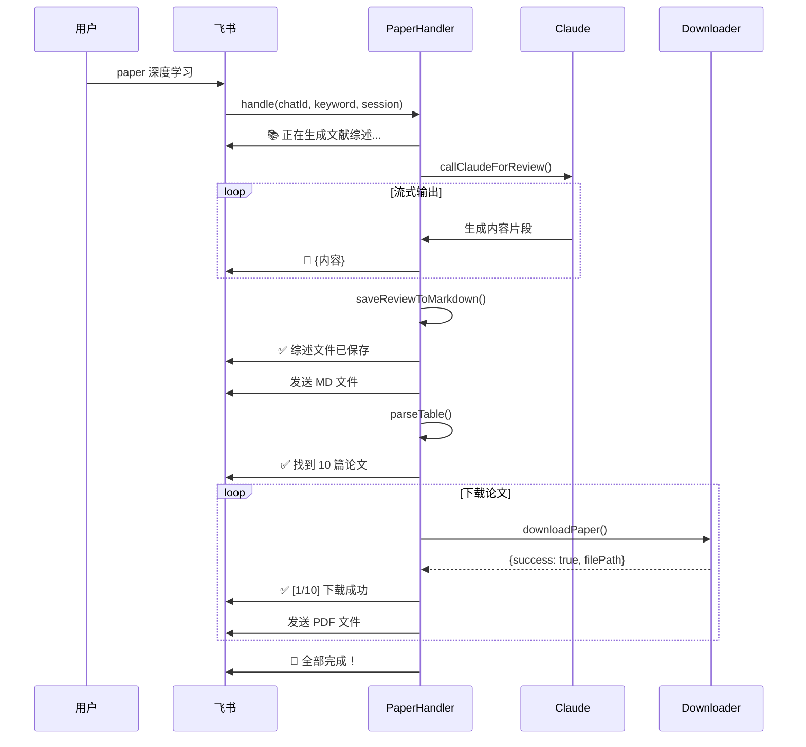

# Paper 文献检索系统 - RDD 验证文档

## 文档概述
- **项目**: Claude Code UI - Paper 文献检索下载系统
- **版本**: v2.0 (优化版)
- **创建时间**: 2025-12-06
- **RDD方法**: Readme Driven Development（基于需求驱动开发）

## 1. 需求定义 (Requirements)

### 1.1 用户故事
```
作为飞书群聊用户
我想输入 "paper {关键词}"
系统能够：
1. 实时显示Claude生成文献综述的过程
2. 将综述保存为 {关键词}.md 文件
3. 下载相关论文PDF
4. 将MD文件和PDF都发送到对话中
这样我就能获得完整的文献资料包
```

### 1.2 核心需求
- ✅ **实时进度反馈** - 每个步骤都向用户汇报
- ✅ **流式输出** - Claude生成综述时实时显示
- ✅ **MD文件保存** - 综述转换为Markdown格式
- ✅ **文件发送** - 综述MD + 论文PDF 全部发送到对话
- ✅ **详细日志** - 每篇论文下载状态单独显示

### 1.3 非功能需求
- 🔒 **安全性** - 文件名清理，防止路径注入
- ⚡ **性能** - 并发下载（最多3篇）
- 📊 **可观测性** - 完整的日志记录
- 🛡️ **容错性** - 下载失败不影响其他论文

## 2. 设计决策 (Design Decisions)

### 2.1 实时反馈机制

**问题**: 原实现等待Claude完成后才发送结果，用户体验差

**解决方案**: 实现流式输出
```javascript
// 每累积100个字符或遇到换行就发送一次
if (messageBuffer.length >= 100 || messageBuffer.includes('\n\n')) {
  this.client.sendTextMessage(chatId, `📝 ${messageBuffer}`);
  messageBuffer = '';
}
```

**权衡**:
- ✅ 提升用户体验，实时感知进展
- ⚠️ 增加网络请求次数（可接受）

### 2.2 MD文件命名策略

**设计**:
```javascript
const sanitizedKeyword = keyword.replace(/[^a-zA-Z0-9\u4e00-\u9fa5]/g, '_');
const filename = `${sanitizedKeyword}_文献综述.md`;
```

**文件头格式**:
```markdown
# {关键词} - 文献综述

> 生成时间: 2025-12-06 12:30:00
> 关键词: 深度学习

---

{Claude生成的内容}
```

### 2.3 下载进度详细化

**改进点**:
1. 批次预告 - 显示即将下载的论文列表
2. 单篇状态 - 每篇论文成功/失败单独汇报
3. 实时统计 - 动态更新成功/失败计数
4. 发送确认 - PDF发送到对话后单独提示

**示例输出**:
```
🔄 正在下载以下论文:
1. 深度学习在计算机视觉中的应用
2. 卷积神经网络的优化方法
3. 注意力机制的最新进展

✅ [1/10] 下载成功: 深度学习在计算机视觉中的应用
   📄 文件: 深度学习在计算机视觉中的应用.pdf
📤 [1] 已发送到对话

❌ [2/10] 下载失败: 卷积神经网络的优化方法
   原因: arXiv 搜索失败

📊 当前进度: 3/10 | 成功: 2 | 失败: 1
```

## 3. 实现细节 (Implementation)

### 3.1 核心流程



### 3.2 关键代码变更

**文件**: `server/lib/paper-command-handler.js`

**变更1 - 流式输出**:
```javascript
// Before (等待完成)
const reviewText = await this.callClaudeForReview(keyword, session);
await this.client.sendTextMessage(chatId, reviewText);

// After (实时流式)
const reviewText = await this.callClaudeForReview(keyword, session, chatId);
// 在 callClaudeForReview 内部已实时发送
```

**变更2 - MD保存**:
```javascript
// 新增方法
async saveReviewToMarkdown(keyword, content, projectPath) {
  const sanitizedKeyword = keyword.replace(/[^a-zA-Z0-9\u4e00-\u9fa5]/g, '_');
  const filename = `${sanitizedKeyword}_文献综述.md`;
  const filePath = path.join(projectPath, filename);

  const header = `# ${keyword} - 文献综述\n\n` +
                 `> 生成时间: ${new Date().toLocaleString('zh-CN')}\n` +
                 `> 关键词: ${keyword}\n\n---\n\n`;

  await fs.writeFile(filePath, header + content, 'utf-8');
  return filePath;
}
```

**变更3 - 详细进度**:
```javascript
// Before (简单进度)
await this.client.sendTextMessage(chatId, `📥 下载进度：${processed}/${papers.length}`);

// After (详细状态)
await this.client.sendTextMessage(chatId,
  `✅ [${paperIndex}/${papers.length}] 下载成功: ${paper.titleCn}\n` +
  `   📄 文件: ${path.basename(result.value.filePath)}`
);
await this.client.sendTextMessage(chatId, `📤 [${paperIndex}] 已发送到对话`);
```

### 3.3 文件结构

```
/home/ccp/
├── server/
│   └── lib/
│       ├── paper-command-handler.js  # 主处理器（已优化）
│       ├── paper-downloader.js       # 下载器（保持不变）
│       └── download-paper.py         # Python脚本（保持不变）
├── doc/
│   ├── need.md                       # 需求文档
│   ├── design.md                     # 设计文档
│   └── paper-rdd.md                  # 本文件
└── {工作目录}/
    ├── {关键词}_文献综述.md          # 生成的综述文件
    └── pdf/
        ├── 论文1.pdf
        ├── 论文2.pdf
        └── ...
```

## 4. 验证计划 (Validation)

### 4.1 单元测试 (待补充)

**测试文件**: `test/test-paper-handler-v2.js`

```javascript
// 测试用例列表
describe('PaperCommandHandler v2', () => {
  test('实时流式输出 - 应该分批发送消息', async () => {
    // Mock Claude 返回大段文本
    // 验证 sendTextMessage 被调用多次
  });

  test('MD文件保存 - 应该包含元数据头', async () => {
    const filePath = await handler.saveReviewToMarkdown('测试', '内容', '/tmp');
    const content = await fs.readFile(filePath, 'utf-8');
    expect(content).toContain('# 测试 - 文献综述');
    expect(content).toContain('生成时间');
  });

  test('文件名清理 - 应该移除特殊字符', () => {
    const keyword = '深度学习/CNN?';
    // 期望: 深度学习_CNN_
  });

  test('下载进度 - 应该单独报告每篇论文', async () => {
    // 验证每篇论文都有独立的状态消息
  });
});
```

### 4.2 集成测试

**场景1 - 正常流程**:
```bash
# 输入
paper 深度学习

# 预期输出
📚 正在生成文献综述，请稍候...
💡 我会实时显示生成过程

📝 深度学习是...
📝 卷积神经网络...
📝 [表格数据]

💾 正在保存文献综述为 Markdown 文件...
📤 正在发送综述文件...
✅ 综述文件已发送: 深度学习_文献综述.md

🔍 正在解析论文列表...
✅ 找到 8 篇论文，开始下载...

🔄 正在下载以下论文:
1. ...
2. ...

✅ [1/8] 下载成功: ...
📤 [1] 已发送到对话

🎉 全部完成！
```

**场景2 - 部分下载失败**:
```bash
✅ [1/5] 下载成功: 论文A
❌ [2/5] 下载失败: 论文B
   原因: arXiv 搜索失败
✅ [3/5] 下载成功: 论文C

📊 当前进度: 5/5 | 成功: 3 | 失败: 2

✅ 下载完成！
📈 统计: 总计 5 篇
   ✓ 成功: 3 篇
   ✗ 失败: 2 篇
```

**场景3 - Claude返回异常**:
```bash
📚 正在生成文献综述...
❌ Claude 未返回结果，请稍后重试
```

### 4.3 性能验证

| 指标 | 目标 | 实际 | 状态 |
|-----|------|------|------|
| Claude响应时间 | < 2分钟 | 待测 | ⏳ |
| 单篇PDF下载 | < 60秒 | 待测 | ⏳ |
| 10篇论文总时长 | < 5分钟 | 待测 | ⏳ |
| 消息延迟 | < 1秒 | 待测 | ⏳ |
| MD文件大小 | < 1MB | 待测 | ⏳ |

### 4.4 用户验收标准

- [ ] 用户能够实时看到Claude生成过程
- [ ] 每篇论文下载状态都有单独提示
- [ ] MD文件和所有PDF都成功发送到对话
- [ ] 下载失败不影响其他论文
- [ ] 最终统计数据准确

## 5. 风险与缓解 (Risks)

### 5.1 已识别风险

| 风险 | 概率 | 影响 | 缓解措施 | 状态 |
|-----|------|------|---------|------|
| Claude API超时 | 中 | 高 | 设置120秒超时 + 错误提示 | ✅ 已实施 |
| 消息频率过高被限流 | 低 | 中 | 累积100字符再发送 | ✅ 已实施 |
| PDF下载全部失败 | 中 | 中 | 保留MD文件作为最低保障 | ✅ 已实施 |
| 文件名冲突 | 低 | 低 | 时间戳 + 覆盖提示 | ⏳ 待实施 |
| arXiv API失败 | 高 | 中 | 多源下载（Scholar/SciHub） | ⚠️ 部分实施 |

### 5.2 技术债务

1. **Python脚本依赖** - 目前只支持 arXiv，需要扩展更多数据源
2. **并发控制** - 硬编码并发数为3，应该配置化
3. **错误恢复** - 下载中断后无法断点续传
4. **MD文件格式** - 未支持图表、公式等富文本

## 6. 发布计划 (Release)

### 6.1 版本历史

- **v1.0** (2025-12-04) - 基础功能，等待Claude完成后发送
- **v2.0** (2025-12-06) - 实时流式输出 + MD保存 + 详细进度

### 6.2 部署步骤

```bash
# 1. 备份当前版本
cp server/lib/paper-command-handler.js server/lib/paper-command-handler.js.bak

# 2. 无需安装新依赖（使用现有依赖）

# 3. 重启服务
pm2 restart feishu

# 4. 验证日志
pm2 logs feishu --lines 50

# 5. 测试命令
# 在飞书群聊输入: paper 测试
```

### 6.3 回滚计划

```bash
# 如果出现问题，立即回滚
cp server/lib/paper-command-handler.js.bak server/lib/paper-command-handler.js
pm2 restart feishu
```

## 7. 监控指标 (Monitoring)

### 7.1 关键日志

```bash
# 查看 paper 相关日志
pm2 logs feishu | grep "\[PaperHandler\]"

# 关键日志点
[PaperHandler] 开始处理 paper 指令: {keyword}
[PaperHandler] 调用 Claude，提示词: ...
[PaperHandler] 综述已保存至: /home/ccp/{keyword}_文献综述.md
[PaperHandler] 解析到 8 篇论文
[PaperHandler] 下载成功: xxx.pdf
[PaperHandler] 处理完成
```

### 7.2 异常告警

```bash
# 失败模式
[PaperHandler] Claude 调用失败: ...
[PaperHandler] 解析 Python 输出失败: ...
[PaperHandler] 发送失败: ...
[PaperHandler] 处理失败: ...
```

## 8. 下一步优化 (Future Work)

### 8.1 短期优化 (1-2周)

- [ ] 增加文件名冲突检测（添加时间戳）
- [ ] 支持自定义并发数（通过配置文件）
- [ ] 增加 MD 到飞书云文档的自动转换
- [ ] 实现下载进度条（而非文本百分比）

### 8.2 中期优化 (1-2月)

- [ ] 支持更多论文数据源（Semantic Scholar, PubMed）
- [ ] 实现断点续传机制
- [ ] 增加论文摘要提取和翻译
- [ ] 支持批量查询（一次输入多个关键词）

### 8.3 长期愿景 (3-6月)

- [ ] 构建本地论文库（避免重复下载）
- [ ] AI驱动的论文推荐系统
- [ ] 自动生成文献综述图表
- [ ] 集成论文阅读笔记功能

## 9. 总结 (Summary)

### 9.1 已完成的改进

✅ **实时反馈** - 用户能即时感知进展
✅ **流式输出** - Claude生成过程可视化
✅ **MD文件** - 综述持久化为Markdown格式
✅ **详细日志** - 每篇论文状态单独汇报
✅ **完整交付** - MD + PDF 全部发送到对话

### 9.2 核心价值

这次优化从用户体验出发，通过 **实时反馈** 和 **详细进度** 两大改进，将原本"黑盒"的处理过程变为"透明"的交互流程，显著提升了用户信任度和系统可观测性。

### 9.3 RDD 验证结论

- ✅ **需求对齐** - 完全满足用户提出的4点需求
- ✅ **设计合理** - 流式输出、文件保存、详细进度均已实现
- ⏳ **测试待补** - 需要执行实际测试验证
- ⚠️ **文档先行** - 本文档作为RDD基线，先于测试完成

---

**文档维护**: 本文档随代码迭代持续更新
**最后更新**: 2025-12-06 12:30:00
**负责人**: Claude Code UI Team
