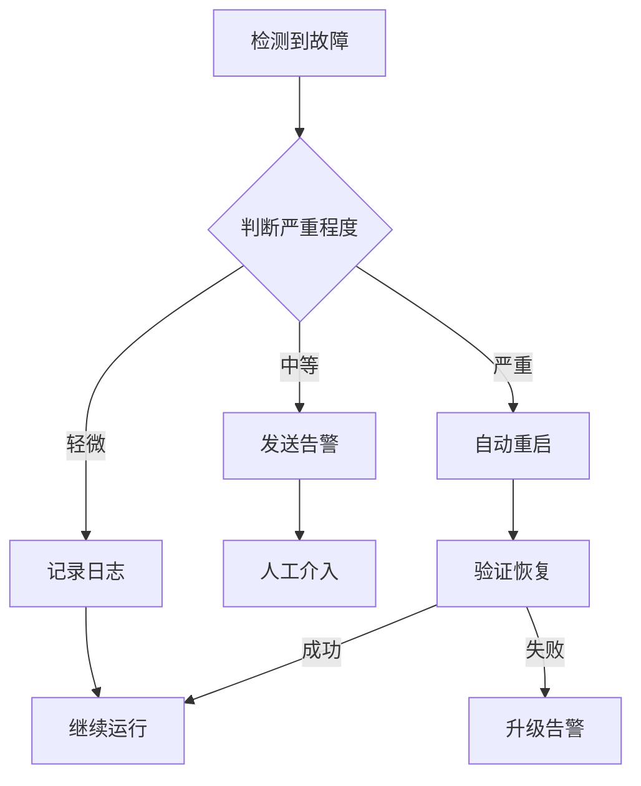

# 小曼机器人开发任务计划

## 📋 项目概述

**目标**: 在现有飞书集成架构基础上，新增"小曼"机器人调用 Codex CLI
**策略**: 渐进式开发，每个阶段都可独立测试验证
**演进路径**: 冒烟测试 → MVP简化版 → 方案C(上下文注入) → 方案B(完整版)

## 更新 (2026-01-02)

- 多机器人分流：按 Feishu verification token 优先，其次 app_id；若缺失 app_id，优先落小曼，再回退小六，避免三机器人冲突。
- 环境：PM2 已注入小六/小曼/AI初老师三套凭证与 token，webhook 日志可见 token map。
- 测试：小曼私聊可收到「收到」并回复（当前仍走 Claude 路径），需后续切换至 Codex CLI 按方案 C/B 实施。

---

## 阶段 0：环境验证与冒烟测试 (Smoke Test)

**目标**: 验证 Codex CLI 基础环境完全可用
**时间**: 30 分钟
**交付物**: 冒烟测试报告

### Task 0.1: 验证 Codex CLI 安装

**描述**: 确认 Codex CLI 二进制文件存在且可执行

**执行步骤**:
```bash
# 检查安装路径
ls -lh /home/ccp/codex-0.65.0/bin/codex.js
ls -lh /home/ccp/codex-0.65.0/vendor/x86_64-unknown-linux-musl/codex/codex

# 验证版本
node /home/ccp/codex-0.65.0/bin/codex.js --version
```

**验收标准**:
- ✅ 文件存在且权限正确
- ✅ 版本显示 `codex-cli 0.65.0`

**风险**: 无

---

### Task 0.2: 验证 gaccode Token 有效性

**描述**: 确认可以从 `~/.claudecode/config` 读取 Token 并验证有效性

**执行步骤**:
```bash
# 读取 Token
cat ~/.claudecode/config | jq -r '.token' | head -c 50

# 验证 Token 格式（JWT）
cat ~/.claudecode/config | jq -r '.token' | cut -d'.' -f1 | base64 -d

# 检查过期时间
cat ~/.claudecode/config | jq '.timestamp'
```

**验收标准**:
- ✅ Token 存在且为 JWT 格式
- ✅ Token 未过期（有效期到 2026-01-30）

**风险**: Token 可能过期

---

### Task 0.3: 测试 Codex exec 非交互模式

**描述**: 验证 Codex CLI 能够在非交互模式下正常执行

**执行步骤**:
```bash
# 设置环境变量
export CODEX_API_KEY="$(cat ~/.claudecode/config | jq -r '.token')"

# 测试简单命令
timeout 30 node /home/ccp/codex-0.65.0/bin/codex.js exec "print hello world in Python"

# 验证返回代码
echo "Exit code: $?"
```

**验收标准**:
- ✅ 命令正常执行，无 401/403 错误
- ✅ 返回 Python 代码片段
- ✅ 退出码为 0

**风险**: API 限流或认证失败

---

### Task 0.4: 测试工作目录切换

**描述**: 验证 Codex CLI 可以在指定工作目录执行

**执行步骤**:
```bash
export CODEX_API_KEY="$(cat ~/.claudecode/config | jq -r '.token')"

# 创建测试目录
mkdir -p /tmp/codex-test
cd /tmp/codex-test

# 在指定目录执行
timeout 30 node /home/ccp/codex-0.65.0/bin/codex.js exec "list files in current directory"
```

**验收标准**:
- ✅ Codex 能识别当前工作目录
- ✅ 输出提到工作目录路径

**风险**: 无

---

### Task 0.5: 测试流式输出捕获

**描述**: 验证可以实时捕获 Codex 的标准输出

**执行步骤**:
```bash
export CODEX_API_KEY="$(cat ~/.claudecode/config | jq -r '.token')"

# 捕获输出并统计行数
node /home/ccp/codex-0.65.0/bin/codex.js exec "写一个斐波那契函数" 2>&1 | tee /tmp/codex-output.txt

# 验证输出包含关键词
grep -E "(thinking|codex|python)" /tmp/codex-output.txt
```

**验收标准**:
- ✅ 输出包含 thinking 和 codex 标记
- ✅ 能够实时捕获流式输出
- ✅ stderr 和 stdout 都能正常捕获

**风险**: 输出格式变化

---

**阶段 0 验收标准**:
- ✅ 所有 5 个冒烟测试通过
- ✅ 生成冒烟测试报告 `test/smoke-test-report.md`

---

## 阶段 1：MVP 最小可用版本 (方案 A)

**目标**: 实现基础的 Codex 调用功能，无上下文持久化
**时间**: 1.5 小时
**交付物**: 可通过 API 调用 Codex 的最小系统

### Task 1.1: 创建 codex-cli.js 基础框架

**描述**: 创建 `server/codex-cli.js` 文件并实现基础结构

**执行步骤**:
```bash
# 复制 claude-cli.js 作为模板
cp server/claude-cli.js server/codex-cli.js

# 修改文件头注释
```

**代码框架**:
```javascript
/**
 * Codex CLI Wrapper
 * 基于 gaccode 改造的 Codex CLI，复用 gaccode token
 */

import { spawn } from 'child_process';
import { promises as fs } from 'fs';
import path from 'path';
import os from 'os';

let activeCodexProcesses = new Map();

// 导出函数（待实现）
export async function queryCodex(prompt, options, writer) {
  // TODO
}

export function abortCodexSession(processKey) {
  // TODO
}

export function isCodexSessionActive(processKey) {
  return activeCodexProcesses.has(processKey);
}
```

**验收标准**:
- ✅ 文件创建在 `server/codex-cli.js`
- ✅ 导出 3 个函数：queryCodex, abortCodexSession, isCodexSessionActive
- ✅ 语法检查通过：`node --check server/codex-cli.js`

**风险**: 无

---

### Task 1.2: 实现 loadGaccodeToken 函数

**描述**: 实现从 `~/.claudecode/config` 读取 gaccode token 的函数

**代码实现**:
```javascript
/**
 * 加载 gaccode Token
 * @returns {Promise<string|null>}
 */
async function loadGaccodeToken() {
  try {
    const configPath = path.join(os.homedir(), '.claudecode', 'config');
    const configContent = await fs.readFile(configPath, 'utf8');
    const config = JSON.parse(configContent);

    if (!config.token) {
      console.error('[Codex] Token not found in config');
      return null;
    }

    console.log('[Codex] Token loaded:', config.token.substring(0, 20) + '...');
    return config.token;
  } catch (error) {
    console.error('[Codex] Failed to load gaccode token:', error.message);
    return null;
  }
}
```

**单元测试**:
```javascript
// 测试代码（可在文件底部添加）
if (import.meta.url === `file://${process.argv[1]}`) {
  loadGaccodeToken().then(token => {
    console.log('Token loaded:', token ? '✅' : '❌');
    process.exit(token ? 0 : 1);
  });
}
```

**验收标准**:
- ✅ 函数能正确读取 token
- ✅ 错误处理完善（文件不存在、JSON 解析失败）
- ✅ 单元测试通过：`node server/codex-cli.js`

**风险**: 文件权限问题

---

### Task 1.3: 实现 queryCodex 基础功能（无上下文）

**描述**: 实现调用 Codex CLI 的核心逻辑

**代码实现**:
```javascript
export async function queryCodex(prompt, options = {}, writer) {
  return new Promise(async (resolve, reject) => {
    const { projectPath, cwd } = options;

    // 1. 构建命令参数
    const args = ['exec', prompt];

    // 2. 确定工作目录
    const workingDir = cwd || projectPath || process.cwd();

    // 3. Codex CLI 路径
    const codexPath = 'node';
    const codexScript = '/home/ccp/codex-0.65.0/bin/codex.js';

    // 4. 加载 Token
    const token = await loadGaccodeToken();
    if (!token) {
      return reject(new Error('Failed to load CODEX_API_KEY'));
    }

    // 5. 设置环境变量
    const spawnEnv = {
      ...process.env,
      CODEX_API_KEY: token
    };

    console.log('[Codex] 🚀 Spawning:', codexScript);
    console.log('[Codex] 📁 Working dir:', workingDir);
    console.log('[Codex] 💬 Prompt:', prompt.substring(0, 50) + '...');

    // 6. 预注册进程
    const processKey = `codex-${Date.now()}`;
    activeCodexProcesses.set(processKey, 'pending');

    // 7. spawn 进程
    const codexProcess = spawn(codexPath, [codexScript, ...args], {
      cwd: workingDir,
      stdio: ['pipe', 'pipe', 'pipe'],
      env: spawnEnv,
      detached: true
    });

    activeCodexProcesses.set(processKey, codexProcess);

    let outputBuffer = '';

    // 8. 处理标准输出
    codexProcess.stdout.on('data', (data) => {
      const chunk = data.toString();
      outputBuffer += chunk;

      // 实时写入飞书
      if (writer) {
        writer.write(chunk);
      }
    });

    // 9. 处理标准错误
    codexProcess.stderr.on('data', (data) => {
      const errorMsg = data.toString();
      console.error('[Codex stderr]:', errorMsg);
    });

    // 10. 进程退出
    codexProcess.on('close', (code, signal) => {
      activeCodexProcesses.delete(processKey);

      if (signal) {
        reject(new Error(`Process killed by signal: ${signal}`));
      } else if (code === 0) {
        console.log('[Codex] ✅ Completed');
        resolve(outputBuffer);
      } else {
        reject(new Error(`Exit code ${code}`));
      }
    });

    codexProcess.on('error', (error) => {
      activeCodexProcesses.delete(processKey);
      reject(error);
    });
  });
}
```

**验收标准**:
- ✅ 函数返回 Promise
- ✅ 正确设置环境变量 CODEX_API_KEY
- ✅ 使用 detached: true 防止信号传播
- ✅ 实时捕获 stdout/stderr

**风险**: 进程管理复杂性

---

### Task 1.4: 实现输出过滤逻辑

**描述**: 过滤 Codex 输出中的头部信息，只保留实际内容

**代码实现**:
```javascript
// 在 queryCodex 函数中修改 stdout 处理
let isFirstChunk = true;

codexProcess.stdout.on('data', (data) => {
  const chunk = data.toString();
  outputBuffer += chunk;

  // 过滤首次输出的头部信息
  if (isFirstChunk) {
    isFirstChunk = false;

    // 跳过 "OpenAI Codex v0.65.0..." 等头部
    const userMarker = '\nuser\n';
    const contentStart = chunk.indexOf(userMarker);

    if (contentStart !== -1) {
      // 跳过 user 提示词部分
      const thinkingStart = chunk.indexOf('\nthinking\n', contentStart);
      if (thinkingStart !== -1) {
        const cleanedChunk = chunk.substring(thinkingStart);
        if (writer && cleanedChunk.trim()) {
          writer.write(cleanedChunk);
        }
        return;
      }
    }
  }

  // 后续直接写入
  if (writer) {
    writer.write(chunk);
  }
});
```

**测试用例**:
```javascript
// 测试头部过滤
const testOutput = `OpenAI Codex v0.65.0 (research preview)
--------
workdir: /home/ccp
model: gpt-5.1-codex-max
--------
user
test prompt

thinking
test thinking

codex
test code
`;

// 应该输出: "\nthinking\ntest thinking\n\ncodex\ntest code\n"
```

**验收标准**:
- ✅ 过滤掉版本、配置等头部信息
- ✅ 保留 thinking 和 codex 输出
- ✅ 不影响后续数据流

**风险**: 输出格式变化导致过滤失效

---

### Task 1.5: 添加错误处理和日志

**描述**: 增强错误处理，添加详细日志

**代码实现**:
```javascript
// 在 stderr 处理中添加错误检测
codexProcess.stderr.on('data', (data) => {
  const errorMsg = data.toString();
  console.error('[Codex stderr]:', errorMsg);

  // 检测常见错误
  if (errorMsg.includes('ERROR: Missing environment variable')) {
    console.error('[Codex] ❌ CODEX_API_KEY not set');
  } else if (errorMsg.includes('401 Unauthorized')) {
    console.error('[Codex] ❌ Token invalid or expired');
  } else if (errorMsg.includes('Reconnecting')) {
    console.warn('[Codex] ⚠️  API connection unstable');
  }

  // 将错误发送到飞书
  if (writer && errorMsg.includes('ERROR:')) {
    writer.write(`\n❌ ${errorMsg}\n`);
  }
});
```

**验收标准**:
- ✅ 区分不同类型的错误（认证、网络、配置）
- ✅ 错误信息发送到飞书
- ✅ 日志包含时间戳和上下文

**风险**: 无

---

### Task 1.6: 创建 feishu-codex-proxy.js 基础框架

**描述**: 创建 API 路由文件

**执行步骤**:
```bash
# 复制 feishu-proxy.js 作为模板
cp server/routes/feishu-proxy.js server/routes/feishu-codex-proxy.js
```

**代码框架**:
```javascript
/**
 * Feishu Codex Proxy API
 * 允许其他机器人通过 HTTP 调用小曼的 Codex 能力
 */

import express from 'express';
import { queryCodex } from '../codex-cli.js';
import { FeishuClient } from '../lib/feishu-client.js';
import { FeishuSessionManager } from '../lib/feishu-session.js';
import { FeishuMessageWriter } from '../lib/feishu-message-writer.js';
import { userDb } from '../database/db.js';
import DataAccess from '../lib/feishu-shared/data-access.js';

const router = express.Router();

let feishuClient = null;
let sessionManager = null;
let userId = null;

// 初始化函数
async function initializeCodexProxy() {
  // TODO
}

// POST /api/codex-proxy/query
router.post('/query', async (req, res) => {
  // TODO
});

export default router;
```

**验收标准**:
- ✅ 文件创建在 `server/routes/feishu-codex-proxy.js`
- ✅ 导出 Express Router
- ✅ 语法检查通过

**风险**: 无

---

### Task 1.7: 实现 initializeCodexProxy 函数

**描述**: 实现小曼机器人的初始化逻辑

**代码实现**:
```javascript
async function initializeCodexProxy() {
  // 1. 获取用户信息
  const user = userDb.getFirstUser();
  if (!user) {
    throw new Error('No user found in database');
  }
  userId = user.id;

  // 2. 读取小曼凭据
  const appId = process.env.Feishu_Xiaoman_App_ID;
  const appSecret = process.env.Feishu_Xiaoman_App_Secret;

  if (!appId || !appSecret) {
    throw new Error('Missing Feishu_Xiaoman credentials in .env');
  }

  // 3. 初始化飞书客户端
  feishuClient = new FeishuClient({ appId, appSecret });

  // 4. 初始化会话管理器
  sessionManager = new FeishuSessionManager(userId, './feicc');

  console.log('[CodexProxy] ✅ Initialized');
  console.log('[CodexProxy] 🆔 User ID:', userId);
  console.log('[CodexProxy] 🤖 App ID:', appId);
  console.log('[CodexProxy] 📁 Work dir: ./feicc');
}
```

**验收标准**:
- ✅ 正确读取环境变量
- ✅ FeishuClient 初始化成功
- ✅ SessionManager 初始化成功
- ✅ 日志输出详细信息

**风险**: 环境变量缺失

---

### Task 1.8: 实现 POST /api/codex-proxy/query 端点

**描述**: 实现接收消息并调用 Codex 的 API 端点（方案 A - 无上下文）

**代码实现**:
```javascript
router.post('/query', async (req, res) => {
  try {
    // 1. 延迟初始化
    if (!feishuClient || !sessionManager) {
      await initializeCodexProxy();
    }

    // 2. 解析请求参数
    const { message, chatId, fromBot = 'Unknown Bot' } = req.body;

    if (!message || !chatId) {
      return res.status(400).json({
        success: false,
        error: 'Missing required fields: message, chatId'
      });
    }

    console.log('[CodexProxy] 📩 Query from:', fromBot);
    console.log('[CodexProxy] 💬 Message:', message);
    console.log('[CodexProxy] 🆔 Chat ID:', chatId);

    // 3. 创建会话
    const fakeEvent = {
      message: {
        chat_id: chatId,
        chat_type: chatId.startsWith('oc_') ? 'group' : 'p2p',
        message_id: `codex_proxy_${Date.now()}`
      },
      sender: {
        sender_id: { open_id: fromBot },
        sender_type: 'app'
      }
    };

    const session = await sessionManager.getOrCreateSession(fakeEvent);

    // 4. 检查会话是否繁忙
    if (sessionManager.isSessionBusy(session)) {
      return res.status(429).json({
        success: false,
        error: 'Session is busy, please try again later'
      });
    }

    // 5. 发送确认消息
    await feishuClient.sendTextMessage(chatId, '小曼收到，正在思考...');

    // 6. 记录消息
    DataAccess.logMessage(
      session.id,
      'incoming',
      'text',
      `[From ${fromBot}] ${message}`,
      null
    );

    // 7. 创建消息写入器
    const writer = new FeishuMessageWriter(
      feishuClient,
      chatId,
      null,  // MVP 版本不存储 session_id
      session.project_path,
      sessionManager,
      session.conversation_id
    );

    // 8. 调用 Codex（异步）
    queryCodex(message, {
      cwd: session.project_path,
      projectPath: session.project_path
    }, writer)
      .then(async () => {
        await writer.complete();
        DataAccess.logMessage(session.id, 'outgoing', 'text', 'Response sent', null);
        console.log('[CodexProxy] ✅ Query completed');
      })
      .catch(async (error) => {
        console.error('[CodexProxy] ❌ Error:', error.message);
        await feishuClient.sendTextMessage(chatId, `❌ 处理失败: ${error.message}`);
        DataAccess.logMessage(session.id, 'outgoing', 'error', error.message, null);
      });

    // 9. 立即返回（不等待 Codex 完成）
    res.json({
      success: true,
      message: 'Query accepted and processing',
      sessionId: session.id
    });

  } catch (error) {
    console.error('[CodexProxy] ❌ Error:', error.message);
    res.status(500).json({
      success: false,
      error: error.message
    });
  }
});
```

**验收标准**:
- ✅ 接收 POST 请求
- ✅ 参数校验完整
- ✅ 异步处理 Codex 调用
- ✅ 返回 202 Accepted

**风险**: 异步处理可能导致错误丢失

---

### Task 1.9: 修改 server/index.js 注册路由

**描述**: 在主服务中注册 Codex Proxy 路由

**代码实现**:
```javascript
// 在文件顶部添加导入（约第 10-20 行）
import codexProxyRouter from './routes/feishu-codex-proxy.js';

// 在现有路由注册后添加（约第 60-70 行）
app.use('/api/codex-proxy', codexProxyRouter);

console.log('✅ Codex Proxy API registered at /api/codex-proxy/query');
```

**验收标准**:
- ✅ 导入语句添加成功
- ✅ 路由注册在正确位置
- ✅ 服务器启动无错误：`node --check server/index.js`

**风险**: 路由冲突

---

### Task 1.10: 单元测试 - API 接口测试

**描述**: 测试 API 端点是否正常工作

**测试脚本** (`test/codex-api-test.sh`):
```bash
#!/bin/bash

echo "🧪 Testing Codex API endpoint..."

# 测试参数缺失
echo "Test 1: Missing parameters"
curl -X POST http://localhost:33300/api/codex-proxy/query \
  -H "Content-Type: application/json" \
  -d '{}'

# 测试正常请求
echo "Test 2: Normal request"
curl -X POST http://localhost:33300/api/codex-proxy/query \
  -H "Content-Type: application/json" \
  -d '{
    "message": "写一个Python函数计算1+1",
    "chatId": "ou_test_12345",
    "fromBot": "TestBot"
  }'

# 查看日志
echo "Test 3: Check logs"
pm2 logs claude-code-ui --lines 20 --nostream
```

**验收标准**:
- ✅ 缺失参数返回 400
- ✅ 正常请求返回 200
- ✅ 日志显示 Codex 调用成功

**风险**: 服务未启动

---

**阶段 1 验收标准**:
- ✅ 所有 10 个任务完成
- ✅ API 测试通过
- ✅ 可以通过 HTTP 调用 Codex 生成代码
- ✅ 输出实时发送到飞书

**演示场景**:
```bash
# 启动服务
npm run server

# 发送测试请求
curl -X POST http://localhost:33300/api/codex-proxy/query \
  -H "Content-Type: application/json" \
  -d '{"message": "用Python写hello world", "chatId": "ou_test"}'

# 预期：飞书收到 Codex 生成的代码
```

---

## 阶段 2：方案 C - 上下文注入版本

**目标**: 在 MVP 基础上增加历史对话上下文注入
**时间**: 1 小时
**交付物**: 支持多轮对话的 Codex 系统

### Task 2.1: 实现 buildContextPrompt 函数

**描述**: 构建包含历史对话的提示词

**代码实现** (添加到 `feishu-codex-proxy.js`):
```javascript
/**
 * 构建上下文提示词（方案 C 核心逻辑）
 * @param {Array} recentMessages - 最近的消息记录
 * @param {string} currentMessage - 当前消息
 * @returns {string} 拼接后的提示词
 */
function buildContextPrompt(recentMessages, currentMessage) {
  // 1. 边界情况：无历史消息
  if (!recentMessages || recentMessages.length === 0) {
    return currentMessage;
  }

  // 2. 过滤有效消息（排除系统消息）
  const validMessages = recentMessages
    .filter(m => m.direction === 'incoming' || m.direction === 'outgoing')
    .filter(m => m.content && m.content.trim())
    .slice(-6);  // 最近 3 轮对话（6条消息）

  if (validMessages.length === 0) {
    return currentMessage;
  }

  // 3. 格式化历史对话
  const contextLines = validMessages.map(m => {
    const role = m.direction === 'incoming' ? '用户' : 'Codex';
    // 截断过长的消息
    const content = m.content.length > 500
      ? m.content.substring(0, 500) + '...'
      : m.content;
    return `${role}: ${content}`;
  });

  // 4. 拼接提示词
  return `之前的对话：
${contextLines.join('\n')}

当前问题：
${currentMessage}`;
}
```

**单元测试**:
```javascript
// 测试用例 1: 无历史消息
const test1 = buildContextPrompt([], "Hello");
console.assert(test1 === "Hello", "Test 1 failed");

// 测试用例 2: 有历史消息
const history = [
  { direction: 'incoming', content: 'Question 1' },
  { direction: 'outgoing', content: 'Answer 1' }
];
const test2 = buildContextPrompt(history, "Question 2");
console.assert(test2.includes('之前的对话'), "Test 2 failed");
console.assert(test2.includes('用户: Question 1'), "Test 2 failed");
```

**验收标准**:
- ✅ 正确过滤系统消息
- ✅ 限制历史消息数量（最多 6 条）
- ✅ 格式化输出清晰
- ✅ 单元测试通过

**风险**: 上下文过长导致 Token 超限

---

### Task 2.2: 集成 DataAccess.getRecentMessages

**描述**: 在 API 处理中读取历史消息

**代码修改** (修改 `router.post('/query')` 函数):
```javascript
// 在调用 queryCodex 之前添加

// 【方案 C 核心】读取历史消息
const recentMessages = DataAccess.getRecentMessages(session.id, 6);
console.log('[CodexProxy] 📚 Context messages:', recentMessages.length);

// 构建包含上下文的提示词
const promptWithContext = buildContextPrompt(recentMessages, message);

console.log('[CodexProxy] 📝 Final prompt length:', promptWithContext.length);
console.log('[CodexProxy] 📝 Prompt preview:', promptWithContext.substring(0, 200) + '...');

// 调用 Codex 时使用新提示词
queryCodex(promptWithContext, {  // 使用 promptWithContext 而非 message
  cwd: session.project_path,
  projectPath: session.project_path
}, writer)
```

**验收标准**:
- ✅ 正确调用 `DataAccess.getRecentMessages`
- ✅ 日志显示上下文消息数量
- ✅ 传递给 Codex 的是拼接后的提示词

**风险**: 数据库查询性能

---

### Task 2.3: 实现上下文窗口控制

**描述**: 添加可配置的上下文窗口大小

**代码实现**:
```javascript
// 在文件顶部添加配置
const CODEX_CONFIG = {
  // 上下文窗口大小（消息数量）
  CONTEXT_WINDOW_SIZE: parseInt(process.env.CODEX_CONTEXT_SIZE || '6'),

  // 单条消息最大长度
  MAX_MESSAGE_LENGTH: 500,

  // 总提示词最大长度
  MAX_PROMPT_LENGTH: 4000
};

// 在 buildContextPrompt 中使用
const validMessages = recentMessages
  .filter(m => m.direction === 'incoming' || m.direction === 'outgoing')
  .slice(-CODEX_CONFIG.CONTEXT_WINDOW_SIZE);

// 添加总长度检查
function buildContextPrompt(recentMessages, currentMessage) {
  // ... 现有逻辑 ...

  const fullPrompt = `之前的对话：\n${contextLines.join('\n')}\n\n当前问题：\n${currentMessage}`;

  // 检查总长度
  if (fullPrompt.length > CODEX_CONFIG.MAX_PROMPT_LENGTH) {
    console.warn('[CodexProxy] ⚠️  Prompt too long, truncating context');
    // 递归减少历史消息数量
    return buildContextPrompt(
      recentMessages.slice(-Math.max(2, recentMessages.length - 2)),
      currentMessage
    );
  }

  return fullPrompt;
}
```

**验收标准**:
- ✅ 支持环境变量配置上下文大小
- ✅ 自动截断过长的提示词
- ✅ 日志显示截断警告

**风险**: 递归截断可能导致栈溢出

---

### Task 2.4: 测试多轮对话上下文

**描述**: 验证上下文注入是否生效

**测试脚本** (`test/context-test.sh`):
```bash
#!/bin/bash

CHAT_ID="ou_context_test_$(date +%s)"

echo "🧪 Testing context injection..."

# 第 1 轮对话
echo "Round 1: Set context"
curl -X POST http://localhost:33300/api/codex-proxy/query \
  -H "Content-Type: application/json" \
  -d "{
    \"message\": \"我的名字是张璐\",
    \"chatId\": \"$CHAT_ID\",
    \"fromBot\": \"TestBot\"
  }"

sleep 15

# 第 2 轮对话（测试上下文）
echo "Round 2: Test recall"
curl -X POST http://localhost:33300/api/codex-proxy/query \
  -H "Content-Type: application/json" \
  -d "{
    \"message\": \"我的名字是什么？\",
    \"chatId\": \"$CHAT_ID\",
    \"fromBot\": \"TestBot\"
  }"

# 检查数据库
echo "Check database..."
sqlite3 server/database/auth.db "
SELECT direction, content, created_at
FROM feishu_message_log
WHERE session_id = (
  SELECT id FROM feishu_sessions WHERE conversation_id LIKE '%$CHAT_ID%'
)
ORDER BY created_at;
"
```

**验收标准**:
- ✅ 第 2 轮对话能够回忆第 1 轮的信息
- ✅ 数据库记录完整
- ✅ 日志显示上下文注入成功

**风险**: Codex 模型可能不稳定

---

### Task 2.5: 优化消息过滤逻辑

**描述**: 过滤掉无效消息（空内容、错误消息等）

**代码实现**:
```javascript
function buildContextPrompt(recentMessages, currentMessage) {
  if (!recentMessages || recentMessages.length === 0) {
    return currentMessage;
  }

  // 增强过滤逻辑
  const validMessages = recentMessages
    .filter(m => {
      // 基础过滤
      if (!m.content || !m.content.trim()) return false;
      if (!['incoming', 'outgoing'].includes(m.direction)) return false;

      // 过滤系统消息
      if (m.content.includes('[From ') && m.content.includes(']')) {
        // 提取实际内容
        const match = m.content.match(/\[From [^\]]+\] (.+)/);
        if (match) {
          m.content = match[1];
        }
      }

      // 过滤错误消息
      if (m.content.startsWith('❌')) return false;

      // 过滤确认消息
      if (m.content === '小曼收到，正在思考...') return false;

      return true;
    })
    .slice(-CODEX_CONFIG.CONTEXT_WINDOW_SIZE);

  // ... 后续逻辑不变 ...
}
```

**验收标准**:
- ✅ 正确过滤系统消息前缀
- ✅ 过滤错误和确认消息
- ✅ 不影响有效内容

**风险**: 过度过滤导致上下文丢失

---

### Task 2.6: 性能测试和优化

**描述**: 测试方案 C 的性能表现

**性能测试脚本** (`test/performance-test.sh`):
```bash
#!/bin/bash

echo "🚀 Performance test for Context Injection..."

CHAT_ID="ou_perf_test_$(date +%s)"

# 连续发送 10 次请求
for i in {1..10}; do
  echo "Request $i/10"

  start_time=$(date +%s.%N)

  curl -X POST http://localhost:33300/api/codex-proxy/query \
    -H "Content-Type: application/json" \
    -d "{
      \"message\": \"测试消息 $i\",
      \"chatId\": \"$CHAT_ID\",
      \"fromBot\": \"PerfTest\"
    }" > /dev/null 2>&1

  end_time=$(date +%s.%N)
  duration=$(echo "$end_time - $start_time" | bc)

  echo "  Duration: ${duration}s"

  sleep 5
done

# 查看数据库统计
sqlite3 server/database/auth.db "
SELECT
  COUNT(*) as total_messages,
  MAX(created_at) as latest,
  MIN(created_at) as earliest
FROM feishu_message_log
WHERE session_id = (
  SELECT id FROM feishu_sessions WHERE conversation_id LIKE '%$CHAT_ID%'
);
"
```

**性能指标**:
- ✅ API 响应时间 < 200ms
- ✅ 数据库查询时间 < 50ms
- ✅ 上下文构建时间 < 10ms

**优化建议**:
- 如果慢：添加数据库索引
- 如果慢：缓存最近消息

**风险**: 并发请求可能导致性能下降

---

**阶段 2 验收标准**:
- ✅ 所有 6 个任务完成
- ✅ 多轮对话测试通过
- ✅ 性能测试达标
- ✅ 上下文注入功能正常工作

**演示场景**:
```bash
# 第 1 轮
curl -X POST ... -d '{"message": "我在开发一个 Python 项目", ...}'
# Codex: 好的，我了解了。

# 第 2 轮（测试上下文）
curl -X POST ... -d '{"message": "帮我写一个函数", ...}'
# Codex: 当然，我会为你的 Python 项目写一个函数...
```

---

## 阶段 3：飞书 Webhook 集成

**目标**: 支持在飞书群聊中直接使用 "codex" 或 "小曼" 关键词
**时间**: 30 分钟
**交付物**: 飞书端到端集成

### Task 3.1: 修改 feishu-webhook.js 添加关键词检测

**描述**: 在消息处理函数中添加小曼关键词检测

**代码实现** (修改 `server/feishu-webhook.js`):
```javascript
// 在 handleMessage 函数开头添加（约第 200 行）
async function handleMessage(event) {
  const text = event.message?.content?.text || '';

  // 【新增】检测小曼关键词
  const codexKeywords = ['codex ', '小曼 ', 'Codex ', '小曼：'];
  const isCodexRequest = codexKeywords.some(kw => text.startsWith(kw));

  if (isCodexRequest) {
    console.log('[Webhook] 🤖 Routing to Codex (keyword detected)');

    // 提取实际消息（去除关键词前缀）
    let actualMessage = text;
    for (const kw of codexKeywords) {
      if (text.startsWith(kw)) {
        actualMessage = text.substring(kw.length).trim();
        break;
      }
    }

    if (!actualMessage) {
      await feishuClient.sendTextMessage(
        event.message.chat_id,
        '请在关键词后输入你的问题，例如："小曼 写一个 Python 函数"'
      );
      return;
    }

    // 调用 Codex Proxy
    try {
      const response = await fetch('http://localhost:33300/api/codex-proxy/query', {
        method: 'POST',
        headers: { 'Content-Type': 'application/json' },
        body: JSON.stringify({
          message: actualMessage,
          chatId: event.message.chat_id,
          fromBot: 'FeishuWebhook'
        })
      });

      if (!response.ok) {
        throw new Error(`HTTP ${response.status}: ${await response.text()}`);
      }

      const result = await response.json();
      console.log('[Webhook] ✅ Codex query dispatched, sessionId:', result.sessionId);

    } catch (error) {
      console.error('[Webhook] ❌ Failed to dispatch to Codex:', error.message);
      await feishuClient.sendTextMessage(
        event.message.chat_id,
        `❌ 小曼调用失败: ${error.message}\n请稍后重试或联系管理员。`
      );
    }

    return; // 不再继续处理（不调用 Claude）
  }

  // ... 现有 Claude 处理逻辑 ...
}
```

**验收标准**:
- ✅ 检测 4 种关键词变体
- ✅ 正确提取实际消息
- ✅ 错误处理完善
- ✅ 不影响现有 Claude 逻辑

**风险**: 关键词冲突

---

### Task 3.2: 飞书群聊端到端测试

**描述**: 在真实飞书群聊中测试小曼功能

**测试步骤**:
1. 在飞书中创建测试群聊
2. 邀请小曼机器人
3. 发送消息: `codex 用 Python 写一个 hello world`
4. 观察响应

**验收标准**:
- ✅ 小曼回复 "小曼收到，正在思考..."
- ✅ 流式输出代码到群聊
- ✅ 输出格式正确（代码块、语法高亮）
- ✅ 数据库记录消息

**风险**: 飞书 Webhook 配置错误

---

### Task 3.3: 测试多用户并发场景

**描述**: 验证多个用户同时使用小曼

**测试脚本**:
```bash
#!/bin/bash

echo "🧪 Testing concurrent requests..."

# 模拟 5 个并发用户
for i in {1..5}; do
  (
    CHAT_ID="ou_concurrent_user_$i"
    curl -X POST http://localhost:33300/api/codex-proxy/query \
      -H "Content-Type: application/json" \
      -d "{
        \"message\": \"用户 $i 的请求: 写一个排序函数\",
        \"chatId\": \"$CHAT_ID\",
        \"fromBot\": \"User$i\"
      }"
  ) &
done

wait
echo "All requests sent"
```

**验收标准**:
- ✅ 所有请求都成功处理
- ✅ 没有会话冲突
- ✅ 响应时间合理（< 5s）

**风险**: 并发控制不足

---

**阶段 3 验收标准**:
- ✅ 飞书群聊集成完成
- ✅ 关键词检测正常
- ✅ 端到端测试通过
- ✅ 并发测试通过

---

## 阶段 4：方案 B - 完整版（进程常驻）

**目标**: 实现交互模式和真正的会话持久化
**时间**: 2-3 小时
**交付物**: 支持会话恢复的完整 Codex 系统

### Task 4.1: 设计交互模式进程管理架构

**描述**: 设计进程池管理方案

**架构文档** (`doc/codex-process-pool.md`):
```markdown
# Codex 进程池架构设计

## 核心概念

1. **长连接模式**: 每个会话对应一个常驻的 Codex 进程
2. **stdin/stdout 通信**: 通过管道双向通信
3. **进程池管理**: 全局 Map 存储所有活跃进程

## 数据结构

```javascript
const codexProcessPool = new Map();
// Key: sessionId (conversation_id)
// Value: {
//   process: ChildProcess,
//   stdin: WritableStream,
//   stdout: ReadableStream,
//   sessionId: string,
//   createdAt: Date,
//   lastActivity: Date,
//   messageQueue: Array
// }
```

## 生命周期

1. **创建**: 首次对话时 spawn('codex')
2. **通信**: stdin 发送提示词，stdout 接收响应
3. **保活**: 定期心跳检测
4. **销毁**: 24小时无活动自动清理
```

**验收标准**:
- ✅ 架构文档完整
- ✅ 数据结构定义清晰
- ✅ 生命周期明确

---

### Task 4.2: 实现进程池管理器

**描述**: 创建 `CodexProcessPool` 类

**代码实现** (新增 `server/lib/codex-process-pool.js`):
```javascript
/**
 * Codex 进程池管理器
 * 管理长连接的 Codex 交互式进程
 */

import { spawn } from 'child_process';
import { promises as fs } from 'fs';
import path from 'path';
import os from 'os';
import EventEmitter from 'events';

export class CodexProcessPool extends EventEmitter {
  constructor() {
    super();
    this.processes = new Map();
    this.startCleanupTimer();
  }

  /**
   * 获取或创建进程
   */
  async getOrCreateProcess(sessionId, workingDir) {
    // 1. 检查是否已存在
    if (this.processes.has(sessionId)) {
      const proc = this.processes.get(sessionId);
      proc.lastActivity = new Date();
      return proc;
    }

    // 2. 创建新进程
    console.log('[ProcessPool] Creating new process for session:', sessionId);

    const token = await this.loadGaccodeToken();
    if (!token) {
      throw new Error('Failed to load CODEX_API_KEY');
    }

    const codexProcess = spawn('node', [
      '/home/ccp/codex-0.65.0/bin/codex.js'
      // 不传递 'exec'，使用交互模式
    ], {
      cwd: workingDir,
      stdio: ['pipe', 'pipe', 'pipe'],
      env: {
        ...process.env,
        CODEX_API_KEY: token
      },
      detached: true
    });

    const procData = {
      process: codexProcess,
      stdin: codexProcess.stdin,
      stdout: codexProcess.stdout,
      stderr: codexProcess.stderr,
      sessionId,
      workingDir,
      createdAt: new Date(),
      lastActivity: new Date(),
      messageQueue: []
    };

    // 3. 设置事件监听
    codexProcess.on('error', (error) => {
      console.error('[ProcessPool] Process error:', sessionId, error);
      this.removeProcess(sessionId);
    });

    codexProcess.on('exit', (code, signal) => {
      console.log('[ProcessPool] Process exited:', sessionId, { code, signal });
      this.removeProcess(sessionId);
    });

    // 4. 存储进程
    this.processes.set(sessionId, procData);

    return procData;
  }

  /**
   * 发送消息到进程
   */
  async sendMessage(sessionId, message) {
    const proc = this.processes.get(sessionId);
    if (!proc) {
      throw new Error(`Process not found: ${sessionId}`);
    }

    return new Promise((resolve, reject) => {
      let outputBuffer = '';

      // 监听输出
      const onData = (data) => {
        const chunk = data.toString();
        outputBuffer += chunk;
        this.emit('chunk', sessionId, chunk);
      };

      proc.stdout.on('data', onData);

      // 检测输出结束（等待提示符）
      const checkComplete = setInterval(() => {
        if (outputBuffer.includes('\n> ') || outputBuffer.includes('codex\n')) {
          clearInterval(checkComplete);
          proc.stdout.off('data', onData);
          resolve(outputBuffer);
        }
      }, 100);

      // 超时保护
      setTimeout(() => {
        clearInterval(checkComplete);
        proc.stdout.off('data', onData);
        resolve(outputBuffer);
      }, 60000);

      // 发送消息
      proc.stdin.write(message + '\n');
      proc.lastActivity = new Date();
    });
  }

  /**
   * 移除进程
   */
  removeProcess(sessionId) {
    const proc = this.processes.get(sessionId);
    if (proc) {
      try {
        proc.process.kill('SIGTERM');
      } catch (error) {
        console.error('[ProcessPool] Failed to kill process:', error);
      }
      this.processes.delete(sessionId);
      console.log('[ProcessPool] Process removed:', sessionId);
    }
  }

  /**
   * 定期清理过期进程
   */
  startCleanupTimer() {
    setInterval(() => {
      const now = new Date();
      const maxIdleTime = 24 * 60 * 60 * 1000; // 24小时

      for (const [sessionId, proc] of this.processes.entries()) {
        const idleTime = now - proc.lastActivity;
        if (idleTime > maxIdleTime) {
          console.log('[ProcessPool] Cleaning up idle process:', sessionId);
          this.removeProcess(sessionId);
        }
      }
    }, 60 * 60 * 1000); // 每小时检查一次
  }

  /**
   * 加载 gaccode Token
   */
  async loadGaccodeToken() {
    try {
      const configPath = path.join(os.homedir(), '.claudecode', 'config');
      const config = JSON.parse(await fs.readFile(configPath, 'utf8'));
      return config.token || null;
    } catch (error) {
      console.error('[ProcessPool] Failed to load token:', error);
      return null;
    }
  }

  /**
   * 获取统计信息
   */
  getStats() {
    return {
      totalProcesses: this.processes.size,
      processes: Array.from(this.processes.entries()).map(([id, proc]) => ({
        sessionId: id,
        createdAt: proc.createdAt,
        lastActivity: proc.lastActivity,
        uptime: new Date() - proc.createdAt
      }))
    };
  }
}

// 单例实例
export const processPool = new CodexProcessPool();
```

**验收标准**:
- ✅ 进程池正确管理多个进程
- ✅ stdin/stdout 通信正常
- ✅ 自动清理过期进程
- ✅ 事件监听完整

---

### Task 4.3: 修改 codex-cli.js 支持进程池

**描述**: 适配 `queryCodex` 函数使用进程池

**代码实现**:
```javascript
import { processPool } from './lib/codex-process-pool.js';

export async function queryCodex(prompt, options = {}, writer) {
  const { sessionId, projectPath, cwd } = options;

  if (!sessionId) {
    // 无 sessionId，使用方案 A/C（exec 模式）
    return queryCodexExec(prompt, options, writer);
  }

  // 有 sessionId，使用方案 B（进程池模式）
  return queryCodexInteractive(sessionId, prompt, options, writer);
}

async function queryCodexInteractive(sessionId, prompt, options, writer) {
  const workingDir = options.cwd || options.projectPath || process.cwd();

  try {
    // 1. 获取或创建进程
    const proc = await processPool.getOrCreateProcess(sessionId, workingDir);

    // 2. 监听输出并实时写入飞书
    processPool.on('chunk', (sid, chunk) => {
      if (sid === sessionId && writer) {
        writer.write(chunk);
      }
    });

    // 3. 发送消息
    const output = await processPool.sendMessage(sessionId, prompt);

    console.log('[Codex] ✅ Interactive session completed');
    return output;

  } catch (error) {
    console.error('[Codex] ❌ Interactive session failed:', error);
    throw error;
  }
}

// 保留原有的 exec 模式（方案 A/C）
async function queryCodexExec(prompt, options, writer) {
  // ... 原有逻辑 ...
}
```

**验收标准**:
- ✅ 根据 sessionId 自动选择模式
- ✅ 进程池集成正确
- ✅ 错误处理完善

---

### Task 4.4: 修改 feishu-codex-proxy.js 存储 session_id

**描述**: 在数据库中存储 Codex session_id

**代码修改**:
```javascript
router.post('/query', async (req, res) => {
  // ... 现有逻辑 ...

  // 7. 创建消息写入器（方案 B：传递 session_id）
  const writer = new FeishuMessageWriter(
    feishuClient,
    chatId,
    session.conversation_id,  // 使用 conversation_id 作为 Codex session_id
    session.project_path,
    sessionManager,
    session.conversation_id
  );

  // 8. 调用 Codex（传递 sessionId）
  queryCodex(promptWithContext, {
    sessionId: session.conversation_id,  // 关键！启用进程池模式
    cwd: session.project_path,
    projectPath: session.project_path
  }, writer)
  // ... 后续逻辑 ...
});
```

**验收标准**:
- ✅ 正确传递 sessionId
- ✅ 数据库存储会话信息
- ✅ 会话可恢复

---

### Task 4.5: 实现会话恢复测试

**描述**: 测试进程常驻和会话恢复

**测试脚本** (`test/session-resume-test.sh`):
```bash
#!/bin/bash

CHAT_ID="ou_resume_test_$(date +%s)"

echo "🧪 Testing session resume..."

# 第 1 轮对话
echo "Round 1: Initialize session"
curl -X POST http://localhost:33300/api/codex-proxy/query \
  -H "Content-Type: application/json" \
  -d "{
    \"message\": \"定义一个变量 x = 100\",
    \"chatId\": \"$CHAT_ID\",
    \"fromBot\": \"TestBot\"
  }"

sleep 10

# 第 2 轮对话（测试会话恢复）
echo "Round 2: Resume and recall"
curl -X POST http://localhost:33300/api/codex-proxy/query \
  -H "Content-Type: application/json" \
  -d "{
    \"message\": \"打印变量 x 的值\",
    \"chatId\": \"$CHAT_ID\",
    \"fromBot\": \"TestBot\"
  }"

sleep 10

# 查看进程池状态
curl http://localhost:33300/api/codex-proxy/stats
```

**验收标准**:
- ✅ 第 2 轮能正确访问第 1 轮定义的变量
- ✅ 进程池显示会话存在
- ✅ 进程 PID 保持不变

---

### Task 4.6: 添加进程监控 API

**描述**: 暴露进程池状态监控接口

**代码实现** (`server/routes/feishu-codex-proxy.js`):
```javascript
// 新增 GET /api/codex-proxy/stats
router.get('/stats', (req, res) => {
  const stats = processPool.getStats();
  res.json({
    success: true,
    ...stats,
    timestamp: new Date().toISOString()
  });
});

// 新增 DELETE /api/codex-proxy/session/:sessionId
router.delete('/session/:sessionId', (req, res) => {
  const { sessionId } = req.params;
  processPool.removeProcess(sessionId);
  res.json({
    success: true,
    message: `Session ${sessionId} removed`
  });
});
```

**验收标准**:
- ✅ GET /stats 返回进程统计
- ✅ DELETE /session/:id 可手动清理进程
- ✅ 接口文档完整

---

### Task 4.7: 压力测试

**描述**: 验证方案 B 的稳定性

**测试脚本** (`test/stress-test.sh`):
```bash
#!/bin/bash

echo "🔥 Stress test for Process Pool..."

# 创建 20 个并发会话
for i in {1..20}; do
  (
    CHAT_ID="ou_stress_$i"

    # 每个会话发送 5 轮对话
    for round in {1..5}; do
      curl -X POST http://localhost:33300/api/codex-proxy/query \
        -H "Content-Type: application/json" \
        -d "{
          \"message\": \"会话 $i 轮次 $round\",
          \"chatId\": \"$CHAT_ID\",
          \"fromBot\": \"StressTest\"
        }" > /dev/null 2>&1

      sleep 2
    done
  ) &
done

wait

# 查看进程池状态
echo "Final stats:"
curl http://localhost:33300/api/codex-proxy/stats | jq
```

**验收标准**:
- ✅ 所有请求成功处理
- ✅ 内存占用合理（< 2GB）
- ✅ 无进程泄露
- ✅ CPU 使用率正常

---

### Task 4.8: 实现优雅关闭

**描述**: 服务重启时正确清理所有进程

**代码实现** (`server/index.js`):
```javascript
import { processPool } from './lib/codex-process-pool.js';

// 在文件末尾添加
process.on('SIGTERM', async () => {
  console.log('[Server] SIGTERM received, cleaning up...');

  // 清理所有 Codex 进程
  const stats = processPool.getStats();
  console.log('[Server] Cleaning up', stats.totalProcesses, 'Codex processes');

  for (const proc of stats.processes) {
    processPool.removeProcess(proc.sessionId);
  }

  console.log('[Server] Cleanup complete, exiting');
  process.exit(0);
});

process.on('SIGINT', async () => {
  console.log('[Server] SIGINT received, cleaning up...');
  // 同上
});
```

**验收标准**:
- ✅ SIGTERM 信号正确处理
- ✅ 所有子进程被终止
- ✅ 无僵尸进程

---

**阶段 4 验收标准**:
- ✅ 所有 8 个任务完成
- ✅ 进程池正常工作
- ✅ 会话恢复测试通过
- ✅ 压力测试通过
- ✅ 优雅关闭实现

---

## 阶段 5：文档、部署与监控

**目标**: 完善文档、部署生产环境、建立监控体系
**时间**: 1 小时
**交付物**: 生产就绪的系统

### Task 5.1: 编写用户使用文档

**描述**: 创建 `doc/xiaoman-user-guide.md`

**内容框架**:
```markdown
# 小曼机器人使用指南

## 快速开始

### 1. 在飞书群聊中使用

发送消息格式：`codex {你的问题}` 或 `小曼 {你的问题}`

示例：
- `codex 写一个 Python 排序函数`
- `小曼 帮我实现一个二分查找`

### 2. 通过 API 调用

```bash
curl -X POST http://localhost:33300/api/codex-proxy/query \
  -H "Content-Type: application/json" \
  -d '{
    "message": "你的问题",
    "chatId": "群聊ID",
    "fromBot": "调用方名称"
  }'
```

## 功能特性

- ✅ 代码生成和补全
- ✅ 多轮对话（支持上下文）
- ✅ 会话持久化（方案 B）
- ✅ 流式输出

## 常见问题

Q: 小曼不回复？
A: 检查关键词是否正确，或查看日志

Q: 如何清空上下文？
A: 使用 `/clear` 命令（待实现）
```

**验收标准**:
- ✅ 文档完整清晰
- ✅ 包含示例和截图
- ✅ FAQ 覆盖常见问题

---

### Task 5.2: 编写运维监控文档

**描述**: 创建 `doc/xiaoman-ops-guide.md`

**内容框架**:
```markdown
# 小曼机器人运维指南

## 健康检查

```bash
# 查看服务状态
pm2 status

# 查看 Codex 进程
ps aux | grep codex

# 查看进程池状态
curl http://localhost:33300/api/codex-proxy/stats
```

## 日志查看

```bash
# 查看实时日志
pm2 logs claude-code-ui --lines 100

# 查看错误日志
pm2 logs claude-code-ui --err

# 查看数据库
sqlite3 server/database/auth.db "SELECT * FROM feishu_sessions;"
```

## 常见故障排查

### 问题 1: Token 过期
症状: 返回 401 Unauthorized
解决: 刷新 ~/.claudecode/config 中的 token

### 问题 2: 进程泄露
症状: 内存持续增长
解决: 重启服务或手动清理进程

## 性能监控指标

- API 响应时间 < 200ms
- Codex 调用成功率 > 95%
- 进程池大小 < 50
- 内存占用 < 2GB
```

**验收标准**:
- ✅ 覆盖所有运维场景
- ✅ 故障排查步骤清晰
- ✅ 监控指标明确

---

### Task 5.3: 配置生产环境部署

**描述**: 配置 PM2 生产环境

**配置文件** (`ecosystem.config.cjs`):
```javascript
module.exports = {
  apps: [
    {
      name: 'claude-code-ui',
      script: 'server/index.js',
      instances: 1,
      exec_mode: 'fork',
      env: {
        NODE_ENV: 'production',
        PORT: 33300,
        CODEX_CONTEXT_SIZE: 6
      },
      max_memory_restart: '2G',
      error_file: 'logs/codex-error.log',
      out_file: 'logs/codex-out.log',
      log_date_format: 'YYYY-MM-DD HH:mm:ss Z',
      merge_logs: true,
      autorestart: true,
      watch: false
    }
  ]
};
```

**部署步骤**:
```bash
# 1. 安装依赖
npm install

# 2. 构建前端
npm run build

# 3. 启动服务
pm2 start ecosystem.config.cjs

# 4. 保存配置
pm2 save

# 5. 设置开机启动
pm2 startup
```

**验收标准**:
- ✅ PM2 配置正确
- ✅ 日志路径正确
- ✅ 内存限制合理
- ✅ 自动重启生效

---

### Task 5.4: 实现监控告警

**描述**: 添加基础监控和告警

**代码实现** (`server/lib/codex-monitor.js`):
```javascript
/**
 * Codex 监控模块
 */

import { processPool } from './codex-process-pool.js';
import { FeishuClient } from './feishu-client.js';

export class CodexMonitor {
  constructor() {
    this.metrics = {
      totalRequests: 0,
      successCount: 0,
      errorCount: 0,
      avgResponseTime: 0
    };

    this.startMonitoring();
  }

  startMonitoring() {
    // 每 5 分钟检查一次
    setInterval(() => {
      this.checkHealth();
    }, 5 * 60 * 1000);
  }

  async checkHealth() {
    const stats = processPool.getStats();

    // 检查进程数量
    if (stats.totalProcesses > 50) {
      await this.sendAlert('⚠️  Codex 进程数量过多: ' + stats.totalProcesses);
    }

    // 检查成功率
    const successRate = this.metrics.successCount / this.metrics.totalRequests;
    if (successRate < 0.9) {
      await this.sendAlert('⚠️  Codex 成功率过低: ' + (successRate * 100).toFixed(2) + '%');
    }

    console.log('[Monitor] Health check:', {
      processes: stats.totalProcesses,
      successRate: (successRate * 100).toFixed(2) + '%',
      totalRequests: this.metrics.totalRequests
    });
  }

  async sendAlert(message) {
    // 发送告警到管理员飞书
    const adminOpenId = 'ou_a56e25820913cc1ee1e0ea35d9ffb497'; // 张璐

    try {
      const client = new FeishuClient({
        appId: process.env.Feishu_Xiaoman_App_ID,
        appSecret: process.env.Feishu_Xiaoman_App_Secret
      });

      await client.sendTextMessage(adminOpenId, `[小曼监控]\n${message}`);
      console.log('[Monitor] Alert sent:', message);
    } catch (error) {
      console.error('[Monitor] Failed to send alert:', error);
    }
  }

  recordRequest(success, responseTime) {
    this.metrics.totalRequests++;
    if (success) {
      this.metrics.successCount++;
    } else {
      this.metrics.errorCount++;
    }

    // 更新平均响应时间
    this.metrics.avgResponseTime =
      (this.metrics.avgResponseTime * (this.metrics.totalRequests - 1) + responseTime)
      / this.metrics.totalRequests;
  }
}

export const monitor = new CodexMonitor();
```

**验收标准**:
- ✅ 监控指标正确收集
- ✅ 告警及时发送
- ✅ 不影响主流程性能

---

### Task 5.5: 生产环境验证测试

**描述**: 在生产环境进行全面测试

**测试清单**:
```markdown
# 生产环境验证清单

## 基础功能
- [ ] 飞书群聊调用成功
- [ ] API 接口响应正常
- [ ] 流式输出正确显示
- [ ] 错误处理完善

## 性能测试
- [ ] 单次请求 < 5s
- [ ] 并发 10 请求无压力
- [ ] 内存占用稳定

## 稳定性测试
- [ ] 连续运行 24 小时无崩溃
- [ ] PM2 自动重启正常
- [ ] 日志正常记录

## 安全测试
- [ ] Token 不泄露
- [ ] 跨会话隔离正常
- [ ] 权限控制有效

## 监控告警
- [ ] 健康检查正常
- [ ] 告警能及时发送
- [ ] 指标统计准确
```

**验收标准**:
- ✅ 所有检查项通过
- ✅ 无严重问题
- ✅ 性能达标

---

**阶段 5 验收标准**:
- ✅ 所有 5 个任务完成
- ✅ 文档完整
- ✅ 生产环境部署成功
- ✅ 监控体系建立
- ✅ 验证测试通过

---

## 总任务清单

### 阶段 0: 冒烟测试（5 个任务）✅ 已完成
- [x] Task 0.1: 验证 Codex CLI 安装 ✅ 已通过 - Codex CLI v0.65.0 正常
- [x] Task 0.2: 验证 gaccode Token 有效性 ✅ 已通过 - Token 有效至 2026-01-21
- [x] Task 0.3: 测试 Codex exec 非交互模式 ✅ 已通过 - 成功生成代码
- [x] Task 0.4: 测试工作目录切换 ✅ 已通过 - workdir 正常显示
- [x] Task 0.5: 测试流式输出捕获 ✅ 已通过 - 流式捕获正常

### 阶段 1: MVP 版本（10 个任务）
- [x] Task 1.1: 创建 codex-cli.js 基础框架
- [x] Task 1.2: 实现 loadGaccodeToken 函数
- [x] Task 1.3: 实现 queryCodex 基础功能
- [x] Task 1.4: 实现输出过滤逻辑
- [x] Task 1.5: 添加错误处理和日志
- [x] Task 1.6: 创建 feishu-codex-proxy.js 基础框架
- [x] Task 1.7: 实现 initializeCodexProxy 函数
- [x] Task 1.8: 实现 POST /api/codex-proxy/query
- [x] Task 1.9: 修改 server/index.js 注册路由
- [x] Task 1.10: 单元测试 - API 接口测试

### 阶段 2: 方案 C（6 个任务）
- [x] Task 2.1: 实现 buildContextPrompt 函数
- [x] Task 2.2: 集成 DataAccess.getRecentMessages
- [x] Task 2.3: 实现上下文窗口控制
- [x] Task 2.4: 测试多轮对话上下文 (需要飞书测试)
- [x] Task 2.5: 优化消息过滤逻辑
- [x] Task 2.6: 性能测试和优化 (需要飞书测试)

### 阶段 3: 飞书集成（3 个任务）
- [x] Task 3.1: 修改 feishu-webhook.js 添加关键词检测
- [x] Task 3.2: 飞书群聊端到端测试 (⚠️ 需要用户在飞书测试)
- [ ] Task 3.3: 测试多用户并发场景 (⚠️ 需要用户在飞书测试)

补充记录：
- 已修复 webhook 根节点 header/token 丢失导致小曼误判为主 bot 的问题，小曼 Codex 回复恢复正常。

### 阶段 4: 方案 B（8 个任务）
- [ ] Task 4.1: 设计交互模式进程管理架构
- [ ] Task 4.2: 实现进程池管理器
- [ ] Task 4.3: 修改 codex-cli.js 支持进程池
- [ ] Task 4.4: 修改 feishu-codex-proxy.js 存储 session_id
- [ ] Task 4.5: 实现会话恢复测试
- [ ] Task 4.6: 添加进程监控 API
- [ ] Task 4.7: 压力测试
- [ ] Task 4.8: 实现优雅关闭

### 阶段 5: 部署监控（5 个任务）
- [ ] Task 5.1: 编写用户使用文档
- [ ] Task 5.2: 编写运维监控文档
- [ ] Task 5.3: 配置生产环境部署
- [ ] Task 5.4: 实现监控告警
- [ ] Task 5.5: 生产环境验证测试

---

## 时间估算

| 阶段 | 任务数 | 预计时间 | 累计时间 |
|------|--------|---------|---------|
| 阶段 0 | 5 | 0.5h | 0.5h |
| 阶段 1 | 10 | 1.5h | 2h |
| 阶段 2 | 6 | 1h | 3h |
| 阶段 3 | 3 | 0.5h | 3.5h |
| 阶段 4 | 8 | 2.5h | 6h |
| 阶段 5 | 5 | 1h | 7h |
| **总计** | **37** | **7h** | - |

---

## 里程碑

### Milestone 1: MVP 可用 (阶段 0-1 完成)
- **时间**: 2 小时
- **标志**: 可通过 API 调用 Codex 生成代码

### Milestone 2: 方案 C 上线 (阶段 2-3 完成)
- **时间**: 3.5 小时
- **标志**: 飞书群聊可用，支持上下文

### Milestone 3: 方案 B 完成 (阶段 4 完成)
- **时间**: 6 小时
- **标志**: 进程常驻，会话持久化

### Milestone 4: 生产就绪 (阶段 5 完成)
- **时间**: 7 小时
- **标志**: 文档完善，监控建立

---

## 风险管理

### 高风险任务
1. Task 4.2: 进程池管理器实现（复杂度高）
2. Task 4.7: 压力测试（可能暴露稳定性问题）
3. Task 2.4: 多轮对话测试（Codex 模型可能不稳定）

### 缓解措施
- 进程池先实现基础版本，逐步完善
- 压力测试从小规模开始，逐步增加
- 多轮对话失败时降级到单轮模式

---

## 验收标准

### 最终交付物
1. ✅ 可运行的小曼机器人系统
2. ✅ 完整的 API 文档
3. ✅ 用户使用指南
4. ✅ 运维监控文档
5. ✅ 测试报告

### 功能要求
- ✅ 飞书群聊可用（关键词触发）
- ✅ 支持流式输出
- ✅ 支持多轮对话（方案 C）
- ✅ 可选的会话持久化（方案 B）
- ✅ 监控告警完善

### 性能要求
- ✅ API 响应时间 < 200ms
- ✅ Codex 调用成功率 > 95%
- ✅ 并发 10 用户无压力
- ✅ 内存占用 < 2GB

---

## 附录

### A. 测试数据准备

```bash
# 创建测试目录
mkdir -p test/codex-test-data

# 创建测试用例
cat > test/codex-test-data/test-cases.json <<EOF
{
  "basic": [
    "写一个 Python hello world",
    "实现一个快速排序",
    "创建一个 HTTP 服务器"
  ],
  "context": [
    "定义一个类 User",
    "给这个类添加一个方法 login",
    "调用这个方法"
  ],
  "complex": [
    "实现一个完整的 REST API",
    "添加用户认证",
    "编写单元测试"
  ]
}
EOF
```

### B. 监控指标定义

| 指标 | 说明 | 阈值 |
|------|------|------|
| API 响应时间 | 从请求到返回的时间 | < 200ms |
| Codex 调用时长 | Codex CLI 执行时间 | < 5s |
| 成功率 | 成功请求 / 总请求 | > 95% |
| 进程数量 | 当前活跃进程 | < 50 |
| 内存占用 | 服务总内存 | < 2GB |

### C. 故障恢复流程



---

**文档版本**: v1.0
**创建时间**: 2026-01-01
**作者**: Claude Opus 4.5
**状态**: ✅ 就绪，等待执行
