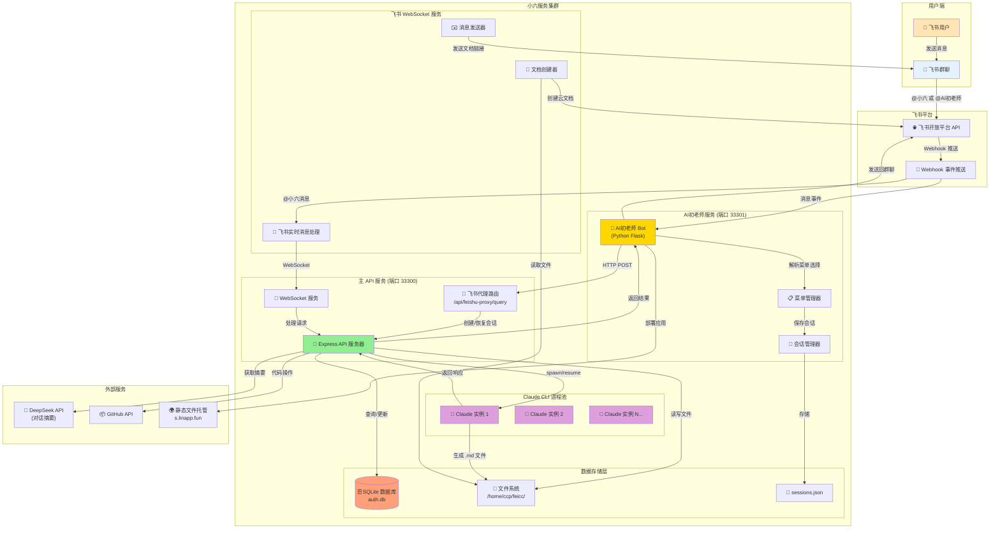

# 小六飞书机器人架构说明

## 架构概览图



## 通俗易懂的解释

### 🎯 小六是什么？

"小六"是一个集成了 Claude AI 的飞书机器人，能够在飞书群聊中提供智能对话和代码协助服务。就像有一个 AI 助手随时在群里待命，可以回答问题、写代码、创建文档。

### 🏗️ 核心组件说明

#### 1. **AI初老师（端口 33301）**
- **作用**：像一个"前台接待员"
- **功能**：
  - 提供菜单式交互界面
  - 引导用户选择不同的服务
  - 记住用户的选择偏好
  - 把复杂请求转发给小六处理

#### 2. **主 API 服务（端口 33300）**
- **作用**：系统的"大脑中枢"
- **功能**：
  - 管理所有 Claude AI 实例
  - 处理会话的创建和恢复
  - 存储对话历史
  - 协调各个组件之间的通信

#### 3. **飞书 WebSocket 服务**
- **作用**：实时"消息快递员"
- **功能**：
  - 监听飞书群聊的实时消息
  - 自动把生成的文档发送到群里
  - 处理文件上传和下载

#### 4. **Claude CLI 进程池**
- **作用**：AI 的"思考引擎"
- **功能**：
  - 多个 Claude 实例并行处理请求
  - 每个会话独立，互不干扰
  - 支持上下文记忆（24小时内）

### 📝 工作流程示例

#### 场景1：通过AI初老师使用
```
1. 用户在群里 @AI初老师："帮我写个贪吃蛇游戏"
2. AI初老师显示菜单："请选择：1.Python版 2.JavaScript版 3.自定义"
3. 用户选择："2"
4. AI初老师调用小六 API 生成代码
5. 小六创建游戏代码并生成文档
6. 文档自动发送到群聊
```

#### 场景2：直接调用小六
```
1. 用户在群里 @小六："解释一下这段代码"
2. 小六直接处理请求
3. 返回代码解释到群聊
```

### 💾 数据存储说明

1. **SQLite 数据库**：存储用户信息、会话记录、API密钥
2. **文件系统**：保存生成的代码文件、文档
3. **sessions.json**：AI初老师的会话状态

### 🔑 关键特性

1. **会话持久化**：即使服务重启，也能记住之前的对话
2. **多租户隔离**：不同群组的对话相互独立
3. **自动文档转换**：Markdown 文件自动转为飞书云文档
4. **智能路由**：根据请求类型自动选择处理方式

### 🚀 优势

- **易用性**：菜单式交互，降低使用门槛
- **高可用**：多实例并行，提高响应速度
- **可扩展**：模块化设计，易于添加新功能
- **安全性**：会话隔离，数据加密存储

### 📊 性能指标

- 并发处理能力：支持多个群组同时使用
- 会话保持时间：24小时
- 响应时间：一般在 2-5 秒内
- 文档生成：支持自动创建和分享

## 总结

小六飞书机器人通过巧妙的架构设计，将 Claude AI 的强大能力无缝集成到飞书平台中，为团队协作提供了智能化的支持。无论是代码开发、文档编写还是问题解答，小六都能快速响应并提供高质量的服务。