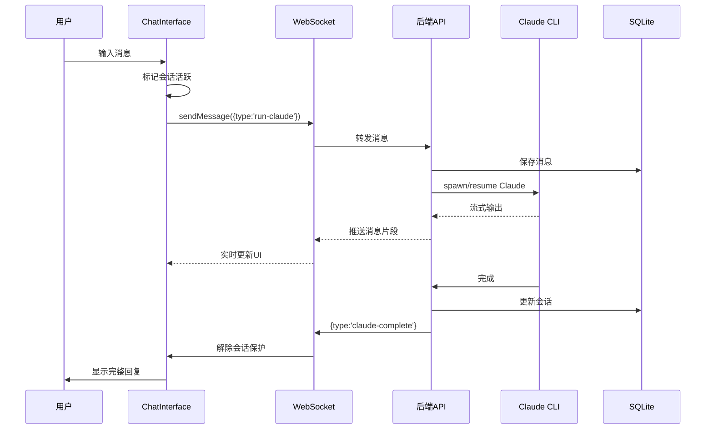
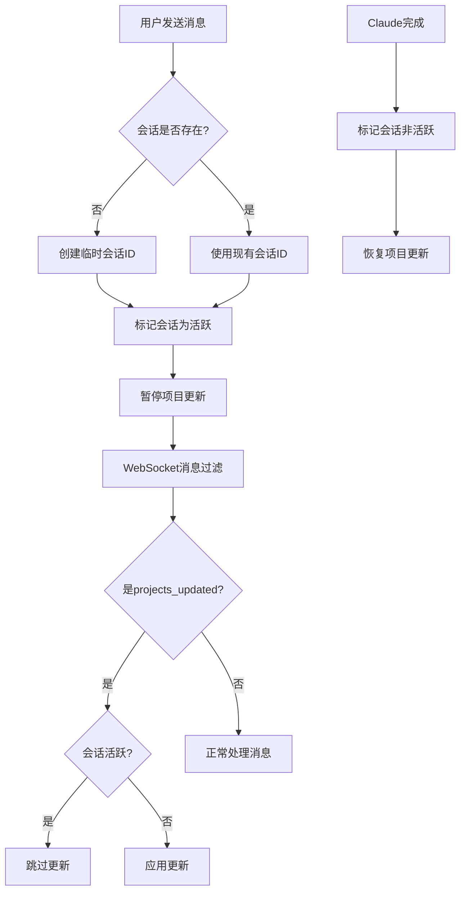
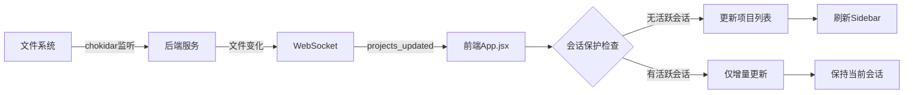

# Claude Code UI - 前端Web架构文档

## 目录
1. [项目概览](#1-项目概览)
2. [技术栈](#2-技术栈)
3. [目录结构](#3-目录结构)
4. [核心架构设计](#4-核心架构设计)
5. [主要功能模块](#5-主要功能模块)
6. [数据流程图](#6-数据流程图)
7. [组件架构图](#7-组件架构图)
8. [API交互方式](#8-api交互方式)
9. [状态管理](#9-状态管理)
10. [关键特性实现](#10-关键特性实现)
11. [构建与部署](#11-构建与部署)
12. [性能优化](#12-性能优化)
13. [快速查找](#13-快速查找)

## 1. 项目概览

Claude Code UI 是一个功能完整的 Web IDE 界面，为 Claude Code CLI 提供图形化交互体验。

### 基本信息
- **框架**: React 18 + Vite
- **样式**: Tailwind CSS
- **代码规模**: ~21,000 行 JSX 代码
- **组件数量**: 46 个 React 组件
- **响应式设计**: 支持桌面/平板/手机
- **PWA支持**: 可安装为本地应用

### 核心特性
- ✅ 实时聊天与AI交互（Claude/Cursor集成）
- ✅ 代码编辑器与语法高亮
- ✅ 文件系统浏览与管理
- ✅ Web终端仿真
- ✅ Git操作集成
- ✅ 任务管理系统（TaskMaster）
- ✅ 深色模式支持
- ✅ 会话保护机制
- ✅ 实时文件更新（WebSocket）

## 2. 技术栈

### 2.1 核心框架
```javascript
// React生态
"react": "^18.2.0"
"react-dom": "^18.2.0"
"react-router-dom": "^6.8.1"

// 构建工具
"vite": "^7.0.4"
"@vitejs/plugin-react": "^4.6.0"

// 样式系统
"tailwindcss": "^3.4.0"
"@tailwindcss/typography": "^0.5.16"
```

### 2.2 代码编辑器
```javascript
// CodeMirror集成
"@uiw/react-codemirror": "^4.23.13"
"@codemirror/lang-javascript": "^6.2.4"
"@codemirror/lang-python": "^6.2.1"
"@codemirror/lang-html": "^6.4.9"
"@codemirror/lang-css": "^6.3.1"
"@codemirror/merge": "^6.11.1"  // Diff视图
"@replit/codemirror-minimap": "^0.5.2"  // 代码地图
```

### 2.3 终端仿真
```javascript
// xterm.js
"@xterm/xterm": "^5.5.0"
"@xterm/addon-fit": "^0.10.0"
"@xterm/addon-clipboard": "^0.1.0"
"@xterm/addon-webgl": "^0.18.0"  // GPU加速
```

### 2.4 文档处理
```javascript
// Markdown渲染
"react-markdown": "^10.1.0"
"remark-gfm": "^4.0.0"  // GitHub Flavor
"remark-math": "^6.0.0"  // 数学公式
"katex": "^0.16.25"  // LaTeX渲染
```

### 2.5 UI组件与工具
```javascript
// 图标与UI
"lucide-react": "^0.515.0"
"class-variance-authority": "^0.7.1"
"clsx": "^2.1.1"

// 文件处理
"react-dropzone": "^14.2.3"  // 拖拽上传

// 搜索
"fuse.js": "^7.0.0"  // 模糊搜索
```

## 3. 目录结构

```
/home/ccp/
├── src/
│   ├── components/           # React组件
│   │   ├── chat/            # 聊天相关组件
│   │   ├── editor/          # 编辑器相关
│   │   ├── settings/        # 设置面板
│   │   ├── taskmaster/      # 任务管理
│   │   └── ui/              # 通用UI组件
│   │
│   ├── contexts/            # React Context（全局状态）
│   │   ├── AuthContext.jsx
│   │   ├── WebSocketContext.jsx
│   │   ├── ThemeContext.jsx
│   │   └── TaskMasterContext.jsx
│   │
│   ├── hooks/               # 自定义Hooks
│   │   ├── useLocalStorage.jsx
│   │   ├── useVersionCheck.js
│   │   └── useAudioRecorder.js
│   │
│   ├── utils/               # 工具函数
│   │   ├── api.js          # API接口定义
│   │   ├── websocket.js    # WebSocket逻辑
│   │   └── whisper.js      # 语音识别
│   │
│   ├── App.jsx             # 应用根组件
│   ├── main.jsx            # 入口文件
│   └── index.css           # 全局样式
│
├── public/
│   ├── manifest.json       # PWA配置
│   ├── sw.js              # Service Worker
│   └── icons/             # 应用图标
│
├── vite.config.js          # Vite配置
├── tailwind.config.js      # Tailwind配置
└── package.json            # 项目依赖
```

## 4. 核心架构设计

### 4.1 整体架构图

```
┌────────────────────────────────────────────────────┐
│                   前端应用 (React + Vite)            │
├────────────────────────────────────────────────────┤
│                                                     │
│  ┌─────────────────────────────────────────────┐  │
│  │            Context Providers                 │  │
│  │  ┌───────┐ ┌──────────┐ ┌──────────────┐  │  │
│  │  │ Theme │ │   Auth   │ │  WebSocket   │  │  │
│  │  └───────┘ └──────────┘ └──────────────┘  │  │
│  └─────────────────────────────────────────────┘  │
│                         ↓                          │
│  ┌─────────────────────────────────────────────┐  │
│  │               App Router                     │  │
│  │    ┌──────────────────────────────┐         │  │
│  │    │ ProtectedRoute → MainLayout  │         │  │
│  │    └──────────────────────────────┘         │  │
│  └─────────────────────────────────────────────┘  │
│                         ↓                          │
│  ┌─────────────────────────────────────────────┐  │
│  │            Main Components                   │  │
│  │  ┌─────────┐ ┌──────────┐ ┌──────────┐    │  │
│  │  │ Sidebar │ │   Chat   │ │  Editor  │    │  │
│  │  └─────────┘ └──────────┘ └──────────┘    │  │
│  │  ┌─────────┐ ┌──────────┐ ┌──────────┐    │  │
│  │  │  Shell  │ │   Files  │ │  Tasks   │    │  │
│  │  └─────────┘ └──────────┘ └──────────┘    │  │
│  └─────────────────────────────────────────────┘  │
│                                                     │
└─────────────────┬──────────────────────────────────┘
                  │
                  ↓ HTTP/WebSocket
┌─────────────────────────────────────────────────────┐
│              后端服务 (Node.js Express)              │
│  ┌────────────┐ ┌──────────┐ ┌────────────────┐   │
│  │  REST API  │ │WebSocket │ │  Shell Server  │   │
│  │  (33300)   │ │   (ws)   │ │    (3002)      │   │
│  └────────────┘ └──────────┘ └────────────────┘   │
│         ↓             ↓              ↓              │
│  ┌──────────────────────────────────────────────┐  │
│  │           SQLite Database                     │  │
│  │  sessions | users | credentials | messages   │  │
│  └──────────────────────────────────────────────┘  │
└─────────────────────────────────────────────────────┘
```

### 4.2 组件层级结构

```
App.jsx
├── ThemeProvider
│   └── AuthProvider
│       └── WebSocketProvider
│           └── TasksSettingsProvider
│               └── TaskMasterProvider
│                   └── Router
│                       ├── LoginRoute
│                       └── ProtectedRoute
│                           └── MainLayout
│                               ├── Sidebar（侧边栏）
│                               │   ├── ProjectList
│                               │   └── SessionList
│                               ├── MainContent（主内容区）
│                               │   ├── ChatInterface
│                               │   ├── CodeEditor
│                               │   ├── FileTree
│                               │   ├── Shell
│                               │   └── TaskList
│                               └── MobileNav（移动导航）
```

## 5. 主要功能模块

### 5.1 聊天界面（ChatInterface）

**位置**: `src/components/ChatInterface.jsx`

**功能特性**:
- Markdown 消息渲染（支持 GFM + 数学公式）
- 工具调用展示（参数、结果、状态）
- Claude 思考过程显示
- 文件拖拽上传
- Token 使用统计
- 语音输入支持（Whisper API）
- 消息流式传输

**核心方法**:
```javascript
handleSubmit(message) {
  // 1. 标记会话为活跃（防止项目更新中断）
  onSessionActive(sessionId);

  // 2. 通过WebSocket发送消息
  sendMessage({
    type: 'run-claude',
    project: projectName,
    sessionId: sessionId,
    message: message,
    tools: selectedTools
  });

  // 3. 等待流式响应
  // 4. 接收到claude-complete后解除保护
}
```

### 5.2 项目管理（Sidebar）

**位置**: `src/components/Sidebar.jsx`

**功能特性**:
- 项目列表展示
- 会话历史管理
- 搜索过滤
- 拖拽排序
- 批量操作
- 实时更新（WebSocket）

**数据结构**:
```javascript
projects = [
  {
    name: "project-name",
    sessions: [
      {
        id: "session-id",
        createdAt: "ISO-8601",
        lastActivity: "ISO-8601",
        messageCount: 10,
        summary: "AI generated summary"
      }
    ]
  }
]
```

### 5.3 代码编辑器（CodeEditor）

**位置**: `src/components/CodeEditor.jsx`

**功能特性**:
- 多语言语法高亮
- Diff 视图（并排对比）
- 代码小地图
- 主题切换（深色/浅色）
- 自定义字体大小
- 全屏模式

**配置选项**:
```javascript
{
  theme: 'dark' | 'light',
  fontSize: 12-20,
  wordWrap: boolean,
  showMinimap: boolean,
  showLineNumbers: boolean
}
```

### 5.4 终端仿真（Shell）

**位置**: `src/components/Shell.jsx`

**功能特性**:
- 完整的 ANSI 终端仿真
- WebSocket 双向通信
- GPU 加速渲染（WebGL）
- 链接点击检测
- 剪贴板支持
- 自适应大小

**连接流程**:
```javascript
1. 创建 xterm 实例
2. 建立 WebSocket 连接（ws://localhost:3002）
3. 双向数据流：
   - 用户输入 → WebSocket → node-pty → 真实终端
   - 终端输出 → node-pty → WebSocket → xterm显示
```

### 5.5 文件浏览器（FileTree）

**位置**: `src/components/FileTree.jsx`

**功能特性**:
- 递归目录树展示
- 多种视图模式（简单/详细/紧凑）
- 文件搜索过滤
- 图片预览
- 文件操作（打开/编辑/删除）
- 文件大小/修改时间显示

### 5.6 任务管理（TaskMaster）

**位置**: `src/components/TaskList.jsx`

**功能特性**:
- 多视图模式（列表/网格/看板）
- 任务过滤与排序
- PRD 文档编辑
- 任务依赖管理
- 执行状态跟踪

## 6. 数据流程图

### 6.1 用户消息发送流程



### 6.2 会话保护机制流程



### 6.3 文件系统监听流程



## 7. 组件架构图

### 7.1 Context层级关系

```
┌─────────────────────────────────────────┐
│            ThemeProvider                │
│  状态: isDarkMode, toggleDarkMode       │
└────────────────┬────────────────────────┘
                 ↓
┌─────────────────────────────────────────┐
│            AuthProvider                 │
│  状态: user, token, isAuthenticated    │
│  方法: login(), logout(), register()   │
└────────────────┬────────────────────────┘
                 ↓
┌─────────────────────────────────────────┐
│         WebSocketProvider               │
│  状态: ws, messages, isConnected        │
│  方法: sendMessage(), reconnect()      │
└────────────────┬────────────────────────┘
                 ↓
┌─────────────────────────────────────────┐
│       TasksSettingsProvider             │
│  状态: tasksEnabled, isInstalled        │
└────────────────┬────────────────────────┘
                 ↓
┌─────────────────────────────────────────┐
│        TaskMasterProvider               │
│  状态: tasks, currentProject            │
│  方法: refreshTasks(), createTask()    │
└─────────────────────────────────────────┘
```

### 7.2 组件通信模式

```
┌──────────────┐     消息发送      ┌──────────────┐
│ChatInterface │ ----------------> │  WebSocket   │
└──────────────┘                   └──────────────┘
       ↑                                   ↓
       │                             消息推送
       │                                   ↓
┌──────────────┐    项目更新       ┌──────────────┐
│   Sidebar    │ <---------------- │   App.jsx    │
└──────────────┘                   └──────────────┘
       ↑                                   ↓
       │                             会话保护
       │                                   ↓
┌──────────────┐    状态同步       ┌──────────────┐
│   FileTree   │ <---------------- │   Context    │
└──────────────┘                   └──────────────┘
```

## 8. API交互方式

### 8.1 REST API

**基础URL**: `http://localhost:33300/api`

**认证头部**:
```javascript
headers: {
  'Authorization': `Bearer ${token}`
}
```

**主要端点**:

| 方法 | 路径 | 描述 |
|------|------|------|
| GET | `/auth/status` | 检查系统状态 |
| POST | `/auth/login` | 用户登录 |
| POST | `/auth/register` | 用户注册 |
| GET | `/projects` | 获取项目列表 |
| GET | `/projects/:name/sessions` | 获取会话 |
| POST | `/projects/:name/sessions/:id` | 创建会话 |
| GET | `/projects/:name/file` | 读取文件 |
| PUT | `/projects/:name/file` | 保存文件 |
| POST | `/transcribe` | 语音转文字 |

### 8.2 WebSocket协议

**连接地址**: `ws://localhost:33300/ws?token=JWT_TOKEN`

**消息格式**:
```javascript
// 客户端 → 服务器
{
  type: 'run-claude',
  project: 'project-name',
  sessionId: 'session-id',
  message: 'user message',
  tools: ['read_file', 'write_file'],
  autoApprove: false
}

// 服务器 → 客户端
{
  type: 'message',
  role: 'assistant',
  content: 'response',
  timestamp: '2024-01-01T00:00:00Z'
}

{
  type: 'projects_updated',
  projects: [...],
  changedFile: 'path/to/file'
}

{
  type: 'claude-complete',
  sessionId: 'session-id'
}
```

## 9. 状态管理

### 9.1 全局状态（Context）

```javascript
// AuthContext
{
  user: { username, email },
  token: string,
  isAuthenticated: boolean,
  needsSetup: boolean,
  hasCompletedOnboarding: boolean
}

// WebSocketContext
{
  ws: WebSocket,
  messages: Array,
  isConnected: boolean,
  reconnectAttempts: number
}

// ThemeContext
{
  isDarkMode: boolean,
  systemTheme: 'dark' | 'light'
}

// TaskMasterContext
{
  tasks: Array,
  currentProject: string,
  isLoading: boolean
}
```

### 9.2 本地存储（localStorage）

```javascript
// 认证
'auth-token': JWT令牌

// UI偏好
'theme': 'dark' | 'light'
'sidebarVisible': boolean
'autoExpandTools': boolean
'showRawParameters': boolean
'showThinking': boolean
'autoScrollToBottom': boolean
'sendByCtrlEnter': boolean

// 编辑器设置
'codeEditorTheme': 'dark' | 'light'
'codeEditorWordWrap': boolean
'codeEditorShowMinimap': boolean
'codeEditorLineNumbers': boolean
'codeEditorFontSize': '12'-'20'

// 文件视图
'file-tree-view-mode': 'simple' | 'detailed' | 'compact'
```

## 10. 关键特性实现

### 10.1 会话保护系统

**问题**: 文件系统变化触发的项目更新会中断用户正在进行的对话

**解决方案**:
```javascript
// App.jsx 中的实现
const [activeSessions, setActiveSessions] = useState(new Set());

// 标记会话活跃
const markSessionAsActive = (sessionId) => {
  setActiveSessions(prev => new Set(prev).add(sessionId));
};

// WebSocket消息处理
useEffect(() => {
  if (message.type === 'projects_updated') {
    // 如果有活跃会话，跳过更新
    if (activeSessions.size > 0) {
      return;
    }
    // 否则正常更新项目
    updateProjects(message.projects);
  }
}, [message]);
```

### 10.2 响应式设计

**断点定义**:
```css
/* tailwind.config.js */
sm: '640px',   // 手机横屏
md: '768px',   // 平板
lg: '1024px',  // 桌面
xl: '1280px',  // 大屏
2xl: '1536px'  // 超大屏
```

**移动适配**:
- 侧边栏 → 底部抽屉
- 水平布局 → 垂直堆叠
- 悬浮按钮 → 底部导航
- 触摸手势支持

### 10.3 PWA功能

**Service Worker功能**:
```javascript
// public/sw.js
- 缓存策略（Cache First）
- 离线访问
- 后台同步
- 推送通知预留
```

**安装提示**:
```javascript
// 检测PWA安装状态
const isPWA = window.matchMedia('(display-mode: standalone)').matches;
```

### 10.4 深色模式

**实现方式**:
```javascript
// ThemeContext.jsx
const [isDarkMode, setIsDarkMode] = useState(
  localStorage.getItem('theme') === 'dark'
);

// 应用主题
useEffect(() => {
  if (isDarkMode) {
    document.documentElement.classList.add('dark');
  } else {
    document.documentElement.classList.remove('dark');
  }
}, [isDarkMode]);
```

## 11. 构建与部署

### 11.1 开发环境

```bash
# 安装依赖
npm install

# 开发模式（前端+后端）
npm run dev

# 仅前端
npm run client

# 仅后端
npm run server
```

### 11.2 生产构建

```bash
# 构建前端
npm run build

# 输出目录: dist/
# 包含:
# - index.html
# - assets/
#   - index-[hash].js
#   - index-[hash].css
#   - vendor chunks
```

### 11.3 Vite配置

```javascript
// vite.config.js
{
  // 代码分割
  rollupOptions: {
    output: {
      manualChunks: {
        'vendor-react': ['react', 'react-dom'],
        'vendor-codemirror': ['@codemirror/*'],
        'vendor-xterm': ['@xterm/*']
      }
    }
  },

  // 代理配置
  server: {
    proxy: {
      '/api': 'http://localhost:3001',
      '/ws': {
        target: 'ws://localhost:3001',
        ws: true
      }
    }
  }
}
```

## 12. 性能优化

### 12.1 代码分割

- **路由级分割**: 使用 React.lazy() 按需加载页面组件
- **Vendor分割**: 将大型依赖（CodeMirror、xterm）单独打包
- **动态导入**: 仅在需要时加载特定功能模块

### 12.2 缓存策略

- **静态资源**: 使用内容哈希命名，永久缓存
- **API响应**: 使用 SWR 模式，先展示缓存再更新
- **Service Worker**: 离线优先，缓存关键资源

### 12.3 渲染优化

- **虚拟滚动**: 长列表使用虚拟化技术
- **防抖/节流**: 搜索、滚动事件优化
- **Memo化**: 使用 React.memo() 避免不必要重渲染

### 12.4 资源优化

- **图片懒加载**: IntersectionObserver 实现
- **WebP格式**: 现代浏览器使用 WebP 图片
- **字体子集化**: 仅加载使用的字符集

## 13. 快速查找

### 13.1 核心文件

| 功能 | 文件路径 |
|------|---------|
| 应用入口 | `src/App.jsx` |
| 聊天界面 | `src/components/ChatInterface.jsx` |
| 项目侧边栏 | `src/components/Sidebar.jsx` |
| 代码编辑器 | `src/components/CodeEditor.jsx` |
| 文件浏览器 | `src/components/FileTree.jsx` |
| Web终端 | `src/components/Shell.jsx` |
| 任务管理 | `src/components/TaskList.jsx` |
| 设置面板 | `src/components/Settings.jsx` |
| API定义 | `src/utils/api.js` |
| WebSocket | `src/utils/websocket.js` |

### 13.2 常用命令

```bash
# 开发
npm run dev          # 启动开发环境
npm run client       # 仅启动前端
npm run server       # 仅启动后端

# 构建
npm run build        # 构建生产版本
npm run preview      # 预览构建结果

# 测试
npm run test         # 运行测试
npm run test:feishu  # 飞书集成测试

# PM2管理
pm2 start ecosystem.config.cjs
pm2 logs
pm2 restart all
```

### 13.3 配置文件

| 文件 | 用途 |
|------|------|
| `vite.config.js` | Vite构建配置 |
| `tailwind.config.js` | Tailwind CSS配置 |
| `package.json` | 项目依赖和脚本 |
| `.env` | 环境变量 |
| `public/manifest.json` | PWA配置 |

### 13.4 调试技巧

```javascript
// 开启调试日志
localStorage.setItem('debug', 'true');

// 查看WebSocket消息
window.ws = ws; // 在控制台可访问

// 查看当前状态
console.log(window.__APP_STATE__);

// 强制刷新项目
window.dispatchEvent(new CustomEvent('refresh-projects'));
```

## 总结

Claude Code UI 是一个现代化的Web IDE界面，采用React生态系统构建，提供了完整的代码编辑、终端仿真、文件管理和AI交互功能。通过WebSocket实现实时通信，使用Context管理全局状态，支持PWA安装和响应式设计，为用户提供流畅的开发体验。

关键创新点：
1. **会话保护机制** - 防止文件更新中断对话
2. **流式消息传输** - 实时展示AI响应
3. **多端适配** - 桌面/平板/手机统一体验
4. **离线支持** - PWA + Service Worker
5. **模块化架构** - 组件解耦，易于扩展

项目持续演进中，欢迎贡献代码和提出改进建议。