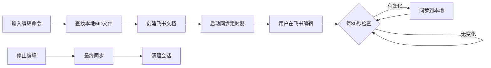

# 飞书文档双向编辑使用指南

## 功能概述

飞书文档双向编辑功能允许用户通过简单的命令，将本地 Markdown 文件转换为可在线编辑的飞书文档，并自动同步编辑内容回本地文件。

### 核心特性

- ✏️ **一键创建编辑会话**：将本地 MD 文件快速转换为飞书文档
- 🔄 **自动双向同步**：每30秒自动同步飞书文档修改到本地
- ⚠️ **智能冲突处理**：检测并保存冲突版本，避免数据丢失
- 📊 **会话管理**：支持查看、停止编辑会话
- 🔒 **数据安全**：自动备份，支持会话恢复

## 快速开始

### 1. 安装和初始化

```bash
# 初始化数据库表
node server/database/init-doc-editor-tables.js

# 配置环境变量（可选）
echo "FEISHU_DOC_SYNC_INTERVAL=30000" >> .env

# 重启服务
pm2 restart claude-code-ui
```

### 2. 基本使用

#### 开始编辑文档

在飞书群聊中@小六机器人：

```
@小六 编辑 README.md
```

机器人会返回：
- 飞书文档链接
- 会话ID
- 同步设置信息

#### 查看编辑状态

```
@小六 编辑状态
```

返回当前所有活跃的编辑会话信息。

#### 停止编辑

```
@小六 停止编辑
```

结束当前编辑会话，执行最后一次同步。

## 支持的命令

| 命令 | 说明 | 示例 |
|------|------|------|
| `编辑 <文件名.md>` | 开始编辑指定文件 | `编辑 docs/guide.md` |
| `edit <文件名.md>` | 英文版编辑命令 | `edit README.md` |
| `修改 <文件名.md>` | 编辑命令的别名 | `修改 test.md` |
| `停止编辑` | 结束当前编辑会话 | `停止编辑` |
| `stop edit` | 英文版停止命令 | `stop edit` |
| `编辑状态` | 查看活跃会话 | `编辑状态` |
| `edit status` | 英文版状态命令 | `edit status` |

## 工作流程



## 功能详解

### 1. 文档格式支持

支持的 Markdown 元素：

- **标题**：# ~ ###### (H1-H6)
- **文本格式**：**加粗**、*斜体*、`代码`、~~删除线~~
- **列表**：有序列表、无序列表、嵌套列表
- **代码块**：支持语言高亮
- **表格**：标准 Markdown 表格
- **链接**：[文本](URL)
- **引用**：> 引用文本
- **分隔线**：---
- **任务列表**：- [ ] 待办事项

### 2. 同步机制

#### 自动同步
- 默认间隔：30秒
- 可通过环境变量 `FEISHU_DOC_SYNC_INTERVAL` 自定义（毫秒）
- 只同步有变化的内容

#### 同步方向
- **飞书→本地**：定时拉取飞书文档内容，转换为 Markdown
- **冲突检测**：本地文件被手动修改时自动检测

### 3. 冲突处理

当检测到本地和远程都有修改时：

1. **创建冲突文件**：`原文件名.conflict.时间戳.md`
2. **保存三个版本**：
   - 飞书文档版本
   - 本地文件版本
   - 原始版本（编辑开始时）
3. **通知用户**：在群聊中提醒用户手动解决冲突

### 4. 会话管理

#### 会话持久化
- 会话信息保存在数据库中
- 服务重启后自动恢复活跃会话
- 24小时后自动清理过期会话

#### 会话限制
- 同一文件同时只能有一个编辑会话
- 同一聊天可以有多个不同文件的编辑会话

### 5. 权限设置

创建的飞书文档默认权限：
- **链接分享**：任何人可编辑
- **外部访问**：开放
- **评论权限**：开放

## 高级配置

### 环境变量

```bash
# 同步间隔（毫秒，默认30000）
FEISHU_DOC_SYNC_INTERVAL=30000

# 测试模式配置
TEST_CHAT_ID=oc_xxx  # 测试用群聊ID
TEST_USER_ID=ou_xxx  # 测试用用户ID
```

### 数据库查询

查看活跃会话：
```sql
SELECT * FROM active_edit_sessions;
```

查看同步统计：
```sql
SELECT * FROM sync_statistics;
```

查看冲突记录：
```sql
SELECT * FROM feishu_conflict_records WHERE resolved = 0;
```

## 故障排查

### 常见问题

#### 1. 文件找不到
- 检查文件路径是否正确
- 确认文件扩展名为 `.md`
- 使用相对于项目根目录的路径

#### 2. 同步失败
- 检查网络连接
- 确认飞书 API 凭证有效
- 查看服务日志：`pm2 logs claude-code-ui`

#### 3. 冲突频繁
- 避免同时在本地和飞书编辑
- 增加同步间隔时间
- 使用"停止编辑"命令正确结束会话

### 日志位置

```bash
# 查看实时日志
pm2 logs claude-code-ui

# 查看编辑器日志
tail -f ~/.pm2/logs/claude-code-ui-out.log | grep DocEditor

# 查看错误日志
tail -f ~/.pm2/logs/claude-code-ui-error.log
```

## 测试功能

运行测试脚本：

```bash
# 运行完整测试
node test/test-doc-editor.js

# 只测试命令解析（无需飞书凭证）
node test/test-doc-editor.js --parse-only
```

## API 参考

### FeishuDocEditor 类

```javascript
// 解析编辑命令
parseEditCommand(text) -> { command, fileName }

// 启动编辑会话
startEditSession(chatId, mdFilePath, userId) -> { success, sessionId, documentUrl, message }

// 停止编辑会话
stopEditSession(sessionId) -> { success, message }

// 获取编辑状态
getEditStatus(chatId) -> string

// 同步文档
syncDocument(sessionId) -> void

// 处理冲突
handleConflict(session, remoteContent, localContent) -> void
```

### FeishuDocReader 类

```javascript
// 读取文档为 Markdown
readDocumentAsMarkdown(documentId) -> { content, revisionId, lastModified, title }

// 获取文档元信息
getDocumentMetadata(documentId) -> { title, revision_id, create_time, update_time }

// 获取所有文档块
getAllDocumentBlocks(documentId) -> array

// 转换块为 Markdown
blocksToMarkdown(blocks) -> string
```

## 最佳实践

1. **编辑前备份**：重要文件编辑前手动备份
2. **单人编辑**：避免多人同时编辑同一文档
3. **及时停止**：编辑完成后及时停止会话
4. **定期检查**：使用"编辑状态"命令检查活跃会话
5. **冲突处理**：发生冲突时优先保存重要版本

## 未来规划

- [ ] 支持更多文件格式（.txt, .json等）
- [ ] 实现增量同步，提高性能
- [ ] 添加版本历史查看功能
- [ ] 支持多人协作提醒
- [ ] 智能冲突自动合并
- [ ] WebSocket 实时同步
- [ ] 文档锁定机制

## 反馈和支持

如遇到问题或有功能建议，请联系技术支持或在项目 GitHub 仓库提交 Issue。

---

*文档版本：1.0.0*
*更新时间：2024年*